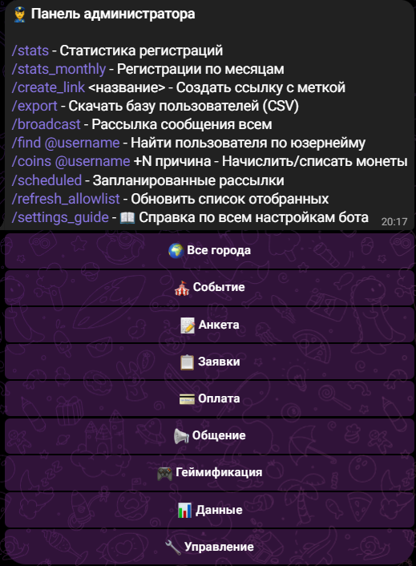

# ⚡ Шпаргалка менеджера

Короткая версия. Подробности — **[ADMIN_GUIDE.md](ADMIN_GUIDE.md)**.
Всё меняется кнопками в Telegram, перезапуск бота не нужен.

`/admin` — восемь разделов по пути делегата: **🎪 Событие** · **📝 Анкета** · **📋 Заявки** ·
**💳 Оплата** · **📢 Общение** · **🎮 Геймификация** · **📊 Данные** · **🔧 Управление**.
Внутри раздела сверху операции, ниже настройки; «← Назад» возвращает в свой раздел.
Отдельного экрана «⚙️ Настройки форума» больше нет — старая кнопка в давней переписке
открывает тот же список разделов.

*Так выглядит `/admin`: команды текстом, шапка города и восемь разделов. Снимок с тестового
стенда в тёмной теме — у себя увидишь те же кнопки со своими данными.*

## Запустить событие за 6 шагов

1. `/admin` → **📝 Анкета** → «🎛 Тип события (пресет)» → «🏛 Форум» или «🎤 Конференция».
2. `/admin` → **🎪 Событие** → «🎪 Событие/Медиа» — дата, время, место, контакты, приветствие, фото.
3. `/admin` → **📋 Заявки** → «📋 Заявки» — тексты: после регистрации / после одобрения / при отклонении.
4. `/admin` → **📝 Анкета** → «📋 Вопросы регистрации» — докрутить анкету; там же «✏️ Тексты вопросов» — формулировки.
5. Тумблеры: «📝 Регистрация: → 📋 Полная» (в 📝 Анкете); «✅ Полная форма: → 👮 Ручная» и «🔔 Уведомление: → 🕒 Пачкой» (в 📋 Заявках).
6. Пройти регистрацию самому, проверить строку в таблице → выкатывать ссылку.

## Первая настройка события

Девять пунктов нового менеджера — по порядку. Всё, кроме первого, делается кнопками в боте
и лежит не глубже трёх нажатий от `/admin`.

1. **Аватар и описание бота** — **@BotFather** (единственный пункт вне нашего бота, и только у владельца): `/mybots` → выбрать бота → **Edit Bot** → «Edit Botpic» (картинка), «Edit Description» (текст на пустом экране до `/start`), «Edit About» (короткая строка в профиле).
2. **Приветствие** — `/admin` → **🎪 Событие** → «🎪 Событие/Медиа» → «✏️ 💬 Приветствие».
3. **Фото приветствия** — тот же экран, кнопка «📷 💬 Фото приветствия» (просто прислать фото).
4. **Инфо о форуме** — тот же экран: «🗓 Дата», «⌚ Время», «📍 Место», «📫 Адрес» (а также фото «📅 Программа», «🗣 Спикеры», «🏢 Площадка»).
5. **Контакты** — там же: «👤 Контакт», «🔵 VK», «🔹 TG».
6. **Кнопки меню делегата** — `/admin` → **🎪 Событие** → «🔘 Кнопки меню»: что делегат видит в меню бота.
7. **Тексты вопросов анкеты** — `/admin` → **📝 Анкета** → «✏️ Тексты вопросов» (`-` — вернуть стандартную формулировку).
8. **Текст после одобрения** — `/admin` → **📋 Заявки** → «📋 Заявки» → «🎉 После одобрения».
9. **Текст при отклонении** — там же, «🚫 При отклонении».

Пункты 8–9 раньше лежали в «📝 Регистрация» — теперь они в «📋 Заявки», рядом с самой
очередью заявок. Если искал их в анкете и не нашёл — вот куда они уехали.

## Хочу X → жму Y

| Хочу | Куда идти |
|------|-----------|
| Одобрить/отклонить заявки | `/admin` → **📋 Заявки** → «📋 Заявки» (карточки по одной) |
| Проверить чеки об оплате | `/admin` → **💳 Оплата** → «🧾 Чеки» |
| Написать всем / сегменту | `/admin` → **📢 Общение** → «📢 Рассылка» → «🎯 По фильтру» |
| Отправить письмо в четверг в 10:00 | 📢 Общение → Рассылка → **🕓 Запланировать** (`/scheduled` — посмотреть/отменить) |
| Собрать опрос | `/admin` → **📢 Общение** → «📊 Опросы» |
| Поменять текст «заявка принята» | `/admin` → **📋 Заявки** → «📋 Заявки» → «✅ После регистрации» (переехал из «📝 Регистрация») |
| Поменять текст после одобрения / при отклонении | Там же: «🎉 После одобрения», «🚫 При отклонении» |
| Поменять приветствие, дату, место, контакты | `/admin` → **🎪 Событие** → «🎪 Событие/Медиа» |
| Поменять любой другой текст, который видит делегат | Раздел по смыслу: 🎪 Событие (приветствия, заглушки), 📋 Заявки (после подачи), 💳 Оплата, 🎮 Геймификация, 🔧 Управление → 🎨 Оформление (тексты приложения); `{скобки}` в тексте не трогать, `-` — вернуть стандартный |
| Включить/выключить вопрос анкеты | `/admin` → **📝 Анкета** → «📋 Вопросы регистрации» |
| Включить акционную анкету (6 вопросов) | `/admin` → **📝 Анкета** → «🎛 Тип события (пресет)» → «⚡ Акция», затем там же тумблер «📝 Регистрация: 📋 Полная → ⚡ Краткая» (обратно — той же кнопкой) |
| Переписать формулировку вопроса | `/admin` → **📝 Анкета** → «✏️ Тексты вопросов» (`-` — вернуть стандартную) |
| Поменять список городов/целей/ВУЗов | `/admin` → **📝 Анкета** → «📝 Регистрация» → нужный список |
| Добавить/выключить город мероприятия, ссылки на города | `/admin` → **🔧 Управление** → «🏙 Города мероприятия» |
| Переименовать вкладки таблицы | `/admin` → **📊 Данные** → «📄 Вкладки таблицы» (бот предупредит, если вкладка уже есть) |
| Настроить оплату | `/admin` → **💳 Оплата** → «💳 Оплата» (тарифы, реквизиты, дедлайн, штрафы) |
| Добавить согласие с PDF | `/admin` → **📝 Анкета** → «📋 Согласия» (список) + «🧾 PDF согласий» (файлы) |
| Ссылка под канал/афишу/партнёра | `/create_link vk_stories` (латиница, без пробелов) |
| Посмотреть, откуда пришли люди | `/admin` → **📊 Данные** → «📈 Источники» |
| Выгрузить базу | `/admin` → **📊 Данные** → «📄 Экспорт CSV» |
| Починить/обновить таблицу | `/admin` → **📊 Данные**: 🔄 Синхронизация · ♻️ Пересобрать · 🧹 Убрать дубли (остаётся свежая строка; обе раскладывают строки по вкладкам городов, если города включены) |
| «Пропали столбцы» в таблице | Сначала: правый клик по букве столбца → «Показать» (скрытые столбцы) или шире диапазон IMPORTRANGE в копии; потом 📊 Данные → ♻️ Пересобрать |
| Показать таблицу коллегам живой копией | В другой таблице: `=IMPORTRANGE("ссылка"; "TG CANDIDATES!A1:Z10000")` → «Разрешить доступ»; только чтение, без цветов |
| Посмотреть, где бросают анкету | `/admin` → **📊 Данные** → «📝 Незавершённые → таблица» (колонка «Остановился на» + сводка «Где отваливаются») |
| Вопрос делегата «повис» без ответа | `/admin` → **📋 Заявки** → «🔒 Залипшие вопросы» |
| Найти человека | `/find @username` |
| Начислить монеты | `/admin` → **🎮 Геймификация** → «🪙 Монеты вручную» (кнопками, с «было → станет») или `/coins @username +50 причина`; история — «📜 Журнал монет» там же |
| Что сейчас включено | `/admin` → **🔧 Управление** → «📖 Справка по настройкам» |
| Добавить менеджера | `/admin` → **🔧 Управление** → «👥 Роли и доступы» → ➕ Добавить менеджера |
| Снять менеджера | Роли и доступы → `➖ Имя — роль` рядом с человеком |
| Выключить роль на время | Роли и доступы → `{роль}: ✅ Вкл → ❌ Выкл` |
| Поменять состав прав роли | Роли и доступы → «✏️ Права роли: …» — чекбоксы, тап сохраняет сразу |
| Создать задание геймификации | `/admin` → **🎮 Геймификация** → «🎯 Задания» → ➕ Новое задание → … → «👁 Так увидит делегат» → **✅ Опубликовать** |
| Поправить задание (текст, монеты, дедлайн, фото) | 🎮 Геймификация → «🎯 Задания» → ✏️ №N → нужная кнопка; «🗄 В архив» — убрать из списка у делегатов |
| Проверить присланные задания | `/admin` → **🎮 Геймификация** → «🎮 Проверка заданий» (карточки по одной, «Осталось: N») |
| Начислить за задание не фиксированную сумму | В карточке — **✏️ Другая сумма** |
| Посмотреть, кто что сдал | Google-таблица, вкладки «Гейма» и «История сдач» (+ «Город Гейма» по городам); обновляются сами, 🎮 Геймификация → «🔄 Таблица геймы» — пересобрать сейчас |
| Цифры по геймификации | `/admin` → **🎮 Геймификация** → «📊 Статистика геймы» |
| Включить приложение (кнопка «📱 Приложение» в меню бота) | `/admin` → **🔧 Управление** → «🎨 Оформление» → «Mini App включён» |
| Скрыть приложение от делегатов, оставить только менеджерам | 🔧 Управление → 🎨 Оформление → «Только менеджерам» (у менеджеров запасной вход остаётся) |
| Выбрать, какие разделы видны в приложении | 🔧 Управление → 🎨 Оформление → чекбоксы разделов (Задания, Монеты, Рейтинг, Профиль — делегату; Проверка сдач, 🗂 Задания (менеджер), Статистика, Настройки-лайт — менеджеру) |
| Сменить оформление приложения (пресет, цвета, шрифт, лого) | 🔧 Управление → 🎨 Оформление → «🎭 Пресеты и ручки оформления» |
| Проверить сдачи / начислить монеты / посмотреть статистику геймы с телефона, без карточек по одной | Кнопка **📱 Приложение** в меню бота — те же права и те же разделы, что и в `/admin` |
| Посмотреть общую картину / открыть веб-дашборд | `/admin` → **📊 Данные** → «📊 Статистика регистраций» → «🌐 Открыть дашборд» (кнопка появляется, только если адрес дашборда настроен при деплое) |
| Выбрать, какие блоки видны на веб-дашборде | `/admin` → **📊 Данные** → «📊 Дашборд» → чекбоксы блоков |
| Начать новый сезон / подтянуть прошлое событие | `/admin` → **🔧 Управление** → «🔄 Новый сезон» (только владелец бота) · «📥 Импорт прошлого события» |

## Бот делает сам

- Догоняет бросивших анкету (≈через 2 часа, один раз).
- Напоминает об оплате за 3 и за 1 день до дедлайна, снимает напоминания после чека.
- Раз в 30 минут шлёт сводку «Заявок в ожидании: N».
- Пишет каждую регистрацию в Google-таблицу и проставляет статус заявки цветом.
- Складывает резюме в облако, в таблицу кладёт ссылку.

## Две ссылки — не путать

- **`/create_link <метка>`** — для каналов, афиш, партнёров. Регистрации считаются по
  метке, вопрос «откуда узнал» таким людям не задаётся.
- **«🔗 Моя реферальная ссылка»** — кнопка в меню, есть у каждого участника. Кто пришёл по
  ней, закрепляется за пригласившим. Для амбассадоров.

## Красные флажки

- **Три кнопки стирают лист целиком** и перезаписывают из базы: ♻️ Пересобрать · 🧹 Убрать
  дубли · 🔄 Таблица геймы. Каждая сначала спросит подтверждение — прочитай его. Пропадёт
  только то, чего нет в базе бота: **заметки, дописанные руками прямо в листе.**
- **Дедлайн задания мягкий:** после срока бот всё равно принимает сдачу, в карточке она
  помечена «⏰ Сдано после дедлайна» — начислять коины или нет, решаешь ты.
- **Кнопка «🎯 Задания» не появится у делегатов сама** — у тех, кто уже пользовался ботом,
  меню обновится только после `/start`. Нужна рассылка с просьбой перезапустить.
- **Кнопка «📱 Приложение» ведёт себя так же** — новым делегатам видна сразу, старым только
  после `/start`; выключенный тумблер «Mini App включён» или пустой адрес при деплое — и
  бот вместо приложения показывает делегату короткое объяснение, что оно сейчас недоступно.
- **В текстах настроек `{скобки}` — не украшение:** туда бот подставляет числа и имена.
  Удалишь — делегат увидит текст без цифры.
- **Переименовывать вкладку регистраций в таблице нельзя** — бот привязан к её имени и после
  переименования начнёт писать в новую вкладку с прежним названием. Это задача разработчику.
- Цвета и выпадашки **не переносятся через IMPORTRANGE** — подключай инструменты к рабочей
  таблице напрямую.
- На телефоне Enter отправляет сообщение: многострочные списки вводи через `;`.
- Кастомные эмодзи Premium бот пересылать не может — ограничение Telegram.
- При 1000+ заявках держи уведомления в режиме «Пачкой».
- Право «⚙️ Настройки» равно админскому (даёт доступ к «👥 Роли и доступы» в разделе
  🔧 Управление) — не выдавай его «просто чтобы поправил текст».

Баг-репорт: **что делал → что ожидал → что произошло** + скриншот.
