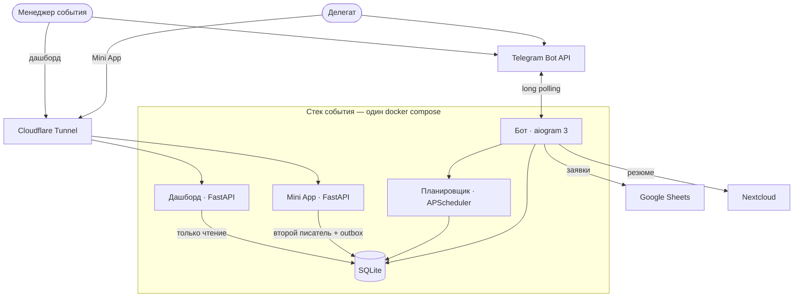
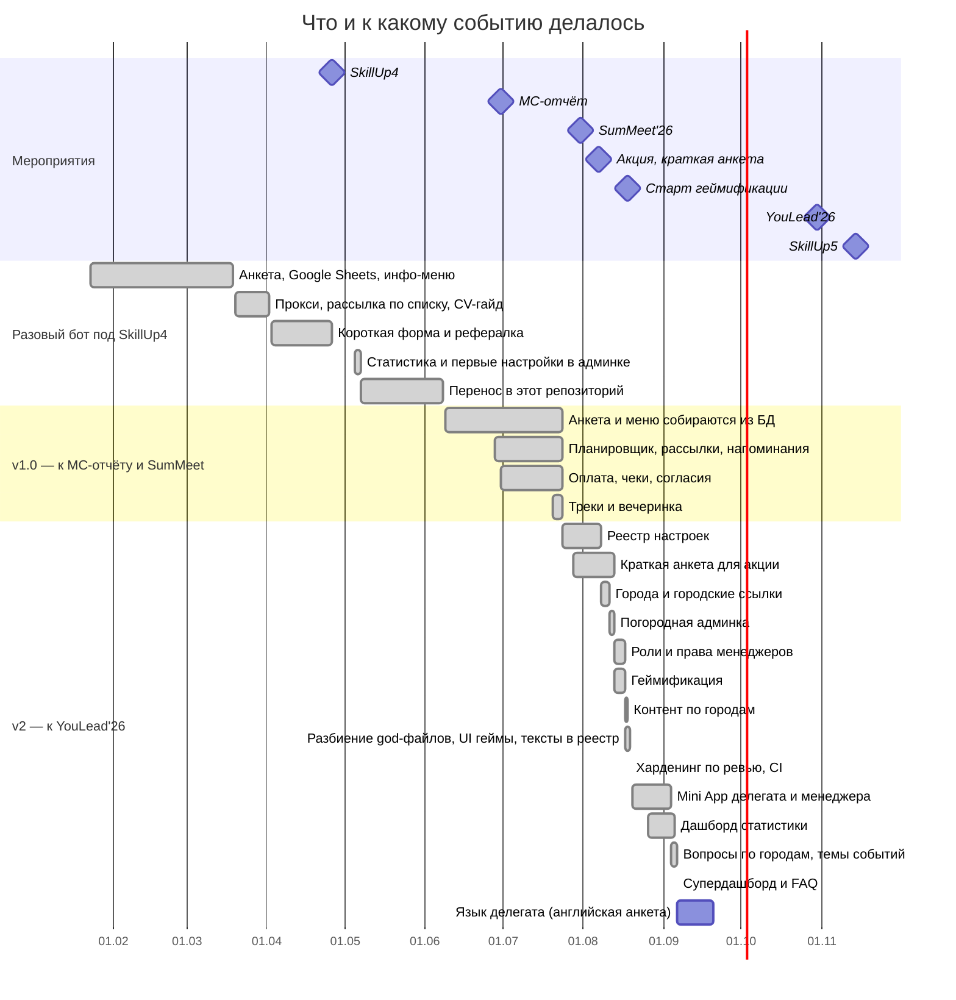

# AIESEC Event Bot

Универсальный Telegram-бот для мероприятий АЙСЕК: форумов (Юлид) и конференций (РилТолк,
СкиллАп). Один код и одна база данных на все события, различия между ними заданы настройками,
не правками кода. Регистрация, модерация заявок, оплата, рассылки, геймификация, Mini App и
дашборд статистики работают из чата бота, без передеплоя.

Главное правило продукта: менеджер события настраивает всё сам, кнопками в Telegram, без
разработчика и без рестарта. Тексты, вопросы анкеты, тарифы и тумблеры модулей живут в базе и
правятся из админки, `.env` хранит только секреты и bootstrap первого запуска.

## Возможности

По пути делегата:

- **Регистрация.** Анкета собирается из включённых вопросов: тумблер на каждый вопрос, треки
  (полный участник, вечеринка с ночёвкой или без, краткая форма под акцию) со своим набором
  вопросов и тарифов. Анкета работает и в чате, и в Mini App с общим черновиком, правка уже
  поданной анкеты сохраняет историю изменений.
- **Города.** Несколько городов мероприятия сразу, например Москва, Санкт-Петербург и Тюмень.
  У каждого своя deep-link-ссылка, свои вопросы, тексты и вкладка в Google-таблице.
  Погородная админка сужает очередь заявок и чеков менеджеру, привязанному к городу
  (привязка хранится настройкой `admin_city__<telegram_id>`).
- **Согласия.** Список согласий на обработку персональных данных с версиями: новая версия
  требует согласия заново, прежнее принятие остаётся в истории для аудита.
- **Модерация.** Пагинированная очередь заявок и чеков, одна карточка на экран, а не сообщение
  на каждую заявку. Нужно на масштабе 1000 с лишним заявок за сезон.
- **Оплата.** Тарифы по трекам, загрузка чека фотографией или файлом, проверка чека менеджером,
  автонапоминания за 3 дня и за 1 день до дедлайна оплаты.
- **Геймификация.** Задания с мягким дедлайном, сдача альбомом или текстом, проверка сдачи
  менеджером, монеты через append-only леджер (баланс всегда пересчитывается из истории),
  рейтинг участников.
- **Mini App.** Веб-версия анкеты, заданий, отбора заявок и настроек внутри Telegram: тот же
  функционал, что в чате бота, удобнее для длинных списков и загрузки файлов.
- **Дашборд статистики.** Read-only воронка регистрации, динамика по дням, срезы по городам,
  трекам, статусам заявок и меткам источников (UTM-метки кампаний, реферальные ссылки).
- **Google-таблица.** Дублирование заявок по вкладкам городов, синхронизация и пересборка
  таблицы кнопкой в админке, без разработчика.
- **Рассылки и напоминания.** Фильтр по городу, треку и статусу заявки, отправка сейчас или по
  расписанию. Расписание хранится в базе и переживает перезапуск бота.

## Архитектура

Один docker-compose стек на событие: бот, планировщик, Mini App и дашборд вокруг одной
SQLite. Наружу смотрит только Cloudflare Tunnel, входящих портов на сервере нет.



SQLite остаётся единственным источником истины: Google-таблица и дашборд читают из неё,
регистрация делегата не зависит от доступности Sheets. Планировщик держит свой job store в
отдельном файле, потому что FSM бота хранится в памяти и сбрасывается при перезапуске, а
отложенные рассылки и напоминания об оплате должны его пережить. Mini App работает как второй
писатель в ту же базу: сдачу задания или монеты он пишет сам, а всё, что требует самого бота
(уведомление делегату, пересборку вкладки таблицы), откладывает в очередь `miniapp_outbox`,
которую разбирает джоба планировщика. Дашборд подключается к той же базе только на чтение.
Наружу дашборд и Mini App смотрят через один Cloudflare Tunnel: сервер не открывает входящих
портов, сертификат выдаёт Cloudflare.

## Путь заявки

Дорожки: делегат, бот, менеджер. Две развилки зависят от настроек события (предотбор и
оплата включаются тумблерами), решают либо бот сам, либо менеджер на карточке заявки и на
карточке чека. Всё, что в дорожке «Бот», идёт без участия людей.


Рядом с процессом крутятся фоновые циклы: догон брошенных анкет, напоминания об оплате,
сводка менеджерам по заявкам в ожидании, тихие часы уведомлений и разбор очереди Mini App.

## Как рос бот

Даты — по коммитам, вехи мероприятий — по срокам заказчика.



## Быстрый старт

Нужен Python 3.11 или новее.

```bash
git clone <url>
cd AIESEC_event_bot

python -m venv .venv
.venv\Scripts\activate          # Windows
source .venv/bin/activate       # Linux, macOS

pip install -r requirements.txt
cp .env.example .env            # заполнить BOT_TOKEN и ADMIN_IDS
python main.py
```

При первом запуске бот сам создаёт `data/forum.db` и `data/jobs.sqlite`. Свой Telegram ID
узнаётся командой `/start` боту [@userinfobot](https://t.me/userinfobot).

Тесты:

```bash
pip install -r requirements-dev.txt
python -m pytest -q
```

Около 3700 тестов на фейках вместо Telegram, Google и Nextcloud, полный прогон занимает
10-20 минут. CI гоняет тот же набор на push и pull request в `main`.

## Конфигурация

`.env` хранит только то, что бот не может спросить в Telegram: токен, доступы, пути на диске.
Всё остальное, тексты, тарифы, вопросы анкеты, тумблеры модулей, живёт в таблице
`bot_settings` и правится из `/admin` в самом боте.

| Переменная | Назначение |
|---|---|
| `BOT_TOKEN`, `ADMIN_IDS` | обязательные: токен от BotFather и Telegram ID bootstrap-суперадминов |
| `GOOGLE_SHEET_ID`, `GOOGLE_CREDENTIALS_FILE` | доступ к Google-таблице, опционально: без них бот работает только на своей базе |
| `PROXY_URL`, `PROXY_URL_BACKUP` | прокси или резервный канал Bot API, если Telegram заблокирован |
| `NEXTCLOUD_*` | адрес и доступ к Nextcloud для загрузки резюме, опционально |
| `EVENT_CITIES`, `EVENT_CITY_DEFAULT`, `GOOGLE_SHEET_TAB`, `PROXY_RECHECK_SECONDS`, `PROXY_CONNECT_TIMEOUT` | разовый seed при первом запуске, дальше значения живут в боте, правки `.env` после старта игнорируются |

Настройка Google Sheets:

1. Создать проект в [Google Cloud Console](https://console.cloud.google.com/), включить
   Google Sheets API и Google Drive API.
2. Создать сервисный аккаунт, скачать ключ в формате JSON, положить рядом с `main.py` под
   именем `google_credentials.json` (файл секретный, в git не идёт).
3. Создать таблицу, взять её ID из URL и вписать в `GOOGLE_SHEET_ID`.
4. Расшарить таблицу на `client_email` из `google_credentials.json` с правами редактора.

Полный разбор переменных с примерами и граблями лежит в комментариях `.env.example`.

## Деплой

На сервере бот разворачивается через `docker compose up -d --build`: свой стек
`docker-compose.yml` на каждое событие, контейнер работает не от root. Дашборд и Mini App
идут sidecar-сервисами того же стека и смотрят наружу через Cloudflare Tunnel, без открытых
портов на сервере. Пошаговая инструкция по домену, туннелю и сети `edge` -
[docs/DEPLOY-DOMAIN.md](docs/DEPLOY-DOMAIN.md).

## Дашборд статистики

Отдельный веб-сервис (`dashboard/`, FastAPI) читает ту же SQLite только для чтения и показывает
KPI, воронку, динамику, разрезы и метки кампаний. Вход по Telegram Login Widget, права из `staff`
бота. Публикуется через Cloudflare Tunnel; разворот описан в [docs/DEPLOY-DOMAIN.md](docs/DEPLOY-DOMAIN.md).

## Документация

| Кому | Файл |
|---|---|
| Менеджеру события, первая настройка | [docs/ADMIN_CHEATSHEET.md](docs/ADMIN_CHEATSHEET.md) |
| Менеджеру события, полный гайд | [docs/ADMIN_GUIDE.md](docs/ADMIN_GUIDE.md) |
| Тестировщику, чек-лист перед приёмкой | [docs/BOT_GUIDE.md](docs/BOT_GUIDE.md) |
| Про трек «вечеринка» | [docs/party-flow-guide.md](docs/party-flow-guide.md) |
| Деплой на домен, туннель, Nextcloud | [docs/DEPLOY-DOMAIN.md](docs/DEPLOY-DOMAIN.md) |
| Конвенции кода и модулей | [docs/CONVENTIONS.md](docs/CONVENTIONS.md) |
| Разработчику, полный справочник (переменные окружения, схема БД, FSM, путь оплаты, дерево проекта) | [docs/REFERENCE.md](docs/REFERENCE.md) |

## Конвенции разработки

Коммиты по-русски, формат `тип(скоуп): тема` (Conventional Commits), скоуп называет модуль
проекта (`admin`, `registration`, `payment`, `db`, `sheets`, `scheduler`). Модуль с
обработчиками не растёт дальше ориентира в 800 строк, порог и причины разреза -
[docs/CONVENTIONS.md](docs/CONVENTIONS.md). Схема базы расширяется только аддитивно:
`CREATE TABLE IF NOT EXISTS` и добавление колонок, без деструктивных миграций на живой базе.

Проверочный вопрос к любой админ-фиче: сможет ли менеджер сделать это один, без разработчика.
