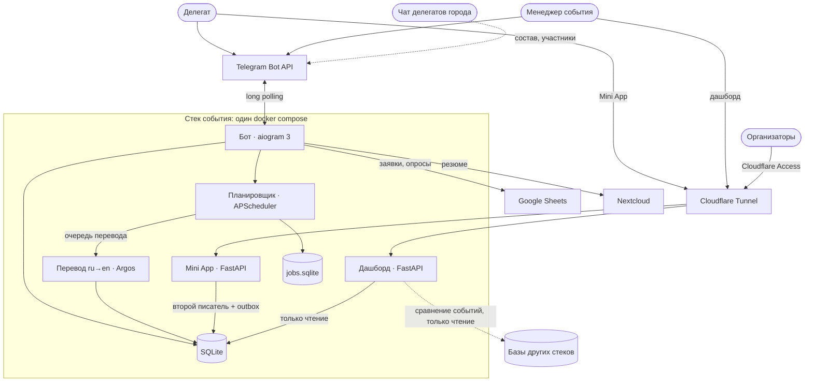
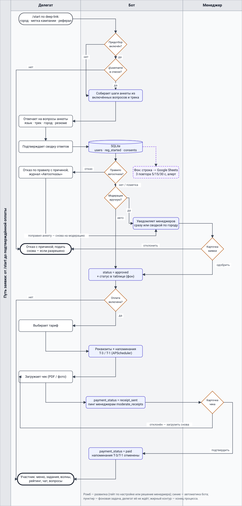
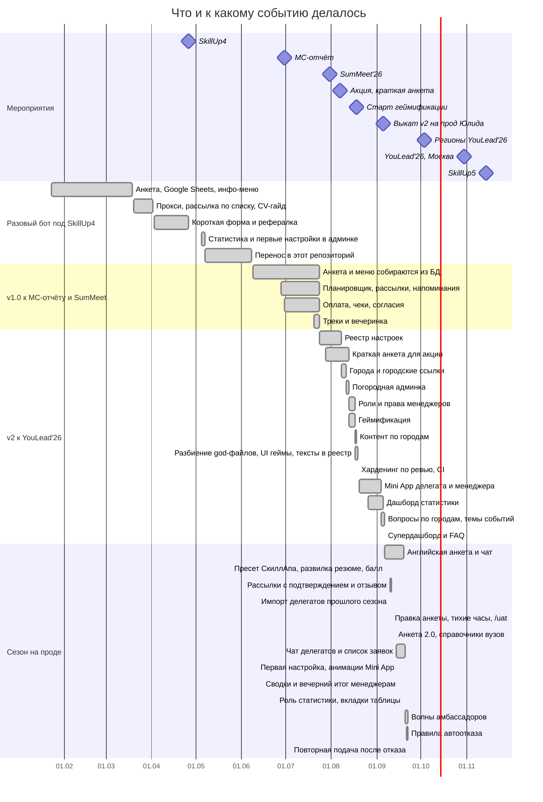

# AIESEC Event Bot

Telegram-бот для мероприятий АЙСЕК: форумов (Юлид) и конференций (РилТолк, СкиллАп). Код один
на все события, а различия между ними задаются настройками. Бот ведёт регистрацию и модерацию
заявок, оплату, рассылки и опросы, задания и волны амбассадоров, чат делегатов. К боту
прилагаются Mini App и дашборд статистики.

Главное правило продукта: менеджер события настраивает всё сам, кнопками в Telegram, без
разработчика и без рестарта. Тексты, вопросы анкеты, тарифы, правила и тумблеры модулей
хранятся в базе и правятся из `/admin`. В `.env` остаются только секреты и bootstrap первого
запуска.

## Возможности

Для делегата, по порядку пути:

- **Язык.** Анкету, меню, оплату и задания можно пройти по-русски или по-английски. Язык
  выбирается кнопками, по настройке бот спрашивает его при первом `/start`. Английский
  корпус переведён вручную. Новые тексты, которые менеджер пишет в админке, встают в очередь
  перевода и переводятся встроенным движком Argos, результат можно поправить руками.
- **Регистрация.** Анкета собирается из включённых вопросов, у каждого вопроса свой тумблер.
  Треки (полный участник, вечеринка, краткая форма под акцию) задают свой набор вопросов и
  тарифов. Вуз и город выбираются из справочника с поиском по первым буквам, опыт вводится
  повторяемыми блоками («Добавить ещё?»). Резюме принимается файлом, ссылкой или текстом,
  файлы уходят в Nextcloud. Анкету делегат проходит в чате или в Mini App: место выбирается
  один раз, черновик общий. Поданную анкету можно поправить по отдельным полям, если это
  разрешено настройкой.
- **Города.** Одно событие может идти в нескольких городах сразу. У города своя
  deep-link-ссылка, свои вопросы, тексты, чат и вкладка в Google-таблице. Менеджер,
  привязанный к городу, видит только его заявки и чеки. Погородная админка хранит эту
  привязку настройкой `admin_city__<telegram_id>`.
- **Согласия.** Согласия на обработку персональных данных хранятся с версиями. Новая версия
  требует согласиться заново, прежние принятия остаются в журнале вместе с нажатой кнопкой.
- **Автоотказ и балл.** Правила автоотказа менеджер собирает кнопками: условия по любому
  вопросу анкеты, группы «И/ИЛИ», возраст на дату форума. Правило либо отклоняет заявку с
  причиной, либо только помечает её для модератора. Автоотказы копятся в журнале, откуда
  заявку можно вернуть на модерацию. Если делегат правит анкету, отказ снимается и заявку
  снова смотрит человек. Отдельно бот считает балл заявки по правилам из реестра, по баллу
  можно сортировать очередь.
- **Модерация.** Очередь заявок и чеков показывает одну карточку на экран: на 1000 с лишним
  заявок за сезон сообщение на каждую заявку засорило бы чат. Список заявок по статусам
  показывает, кто принял решение. Менеджеры получают уведомление о каждой заявке или сводку
  по городу, вечером приходит итог, кто сколько проверил. Повторная подача после отказа
  включается тумблером, для каждого города отдельно.
- **Оплата.** Тарифы по трекам, чек фотографией или файлом, проверка чека менеджером,
  напоминания за 3 дня и за 1 день до дедлайна.
- **Амбассадоры и геймификация.** Делегат берёт свою реферальную ссылку `amb_<id>` и
  становится амбассадором, за каждого одобренного приглашённого ему начисляются баллы.
  Задания сдаются альбомом или текстом, у задания бывает мягкий дедлайн и штраф за просрочку.
  Монеты ведутся append-only леджером, баланс всегда пересчитывается из истории. Волны
  амбассадоров идут по очереди, у каждого города своя нумерация. У волны свои задания и
  рейтинг, итоги объявляются по замороженному снимку призёров.
- **Чат делегатов.** Бот привязывается к чату города, сверяет состав и учитывает участников.
  Рассылку можно отправить только тем, кто в чате, или только тем, кого там нет.
- **Частые вопросы.** Делегат видит раздел FAQ перед формой вопроса организаторам. Ответ из
  журнала вопросов менеджер переносит в FAQ одной кнопкой.

Для менеджера и организаторов:

- **Рассылки и опросы.** Фильтры по городу, треку, статусу, сезону, наличию резюме,
  автоотказу и присутствию в чате. Перед отправкой рассылку нужно подтвердить. Её можно
  отложить на время, остановить на ходу и отозвать у получателей. Опросы уходят нативными
  опросами Telegram, итоги выгружаются в таблицу. В тихие часы уведомления копятся до утра.
  Расписание хранится в базе и переживает перезапуск.
- **Роли.** Права выдаются по отдельности: модерация заявок, чеков и заданий, настройки,
  статистика. Есть готовые роли, например «Менеджер статистики» с единственным правом на
  цифры.
- **Пресеты и первая настройка.** Пресет события («СкиллАп» и другие) настраивает форум одной
  кнопкой. Мастер «Первая настройка» в Mini App ведёт по шагам под тип события.
- **Mini App.** Та же анкета, задания, отбор заявок, FAQ и настройки внутри Telegram. Длинные
  списки и загрузку файлов там делать удобнее. Тема, язык и анимации настраиваются.
- **Дашборд статистики.** Работает только на чтение. Показывает KPI, воронку с отдельной
  ступенью автоотказа, динамику по дням и месяцам, разрезы по городам, трекам и меткам
  кампаний, время обработки заявки и ответа на вопрос, блоки рефералов, амбассадоров,
  геймификации и чата. Второй ряд KPI считает только реальные заявки, без автоотклонённых.
  Супердашборд ставит несколько событий рядом. Публикуется через Cloudflare Tunnel, разворот
  описан в [docs/DEPLOY-DOMAIN.md](docs/DEPLOY-DOMAIN.md).
- **Google-таблица.** Заявки дублируются по вкладкам городов и треков. Пересборка таблицы,
  переименование вкладок и префикс для вкладок бота запускаются кнопкой в админке.
- **Приёмка.** Команда `/uat` выдаёт тестеру нужное состояние анкеты и роль. Общая доска
  приёмки лежит в `tools/uat_board/`.

## Архитектура

На каждое событие поднимается свой docker-compose стек: бот, Mini App и дашборд вокруг одной
SQLite. Наружу стек открыт только через Cloudflare Tunnel, входящих портов на сервере нет.


```mermaid
flowchart TB
    delegate(["Делегат"]) --> tg
    manager(["Менеджер события"]) --> tg
    tg["Telegram Bot API"] <-- "long polling" --> bot
    chat(["Чат делегатов города"]) -. "состав, участники" .-> tg

    subgraph stack["Стек события: один docker compose"]
        direction TB
        bot["Бот · aiogram 3"]
        sched["Планировщик · APScheduler"]
        i18n["Перевод ru→en · Argos"]
        miniapp["Mini App · FastAPI"]
        dash["Дашборд · FastAPI"]
        db[("SQLite")]
        jobs[("jobs.sqlite")]
        bot --> db
        bot --> sched
        sched --> jobs
        sched -- "очередь перевода" --> i18n --> db
        miniapp -- "второй писатель + outbox" --> db
        dash -- "только чтение" --> db
    end

    bot -- "заявки, опросы" --> sheets["Google Sheets"]
    bot -- "резюме" --> nextcloud["Nextcloud"]
    cf["Cloudflare Tunnel"] --> miniapp
    cf --> dash
    delegate -- "Mini App" --> cf
    manager -- "дашборд" --> cf
    owner(["Организаторы"]) -- "Cloudflare Access" --> cf
    dash -. "сравнение событий, только чтение" .-> others[("Базы других стеков")]
```

Источник истины один: SQLite. Google-таблица и дашборд читают из неё, поэтому регистрация не
зависит от доступности Sheets. Если строка не записалась в таблицу, бот трижды повторяет
попытку и шлёт алерт.

FSM бота живёт в памяти и сбрасывается при перезапуске. Поэтому планировщик держит свои
задания в отдельном файле `jobs.sqlite`, и отложенные рассылки, напоминания об оплате, джобы
волн, повтор выгрузки резюме и очередь перевода переживают рестарт.

Mini App пишет в ту же базу вторым писателем. Сдачу задания или правку менеджера он
записывает сам. Всё, для чего нужен бот (сообщение делегату, пересборка вкладки таблицы), он
откладывает в очередь `miniapp_outbox`, а её разбирает джоба планировщика. Рестарт бота
Mini App не обновляет, его пересобирают отдельно:
`docker compose up -d --build --no-deps miniapp`.

Дашборд подключается к базе только на чтение. В режиме сравнения он так же читает базы
других событий, вход туда закрыт Cloudflare Access.

Перевод по умолчанию работает внутри процесса бота. Сайдкар LibreTranslate описан в
`docker-compose.yml` профилем `i18n` и без явного профиля не запускается.

## Путь заявки

Три дорожки: делегат, бот, менеджер. Развилки зависят от настроек события: предотбор,
правила автоотказа, ручная модерация и оплата включаются тумблерами. Решает либо бот, либо
менеджер на карточке заявки или чека. Всё в дорожке «Бот» идёт без участия людей.



Схему рисует скрипт `docs/diagrams/gen_application_flow_bpmn.py`.

Параллельно с процессом работают фоновые джобы: догон брошенных анкет, напоминания об оплате,
сводка менеджерам по заявкам в ожидании, вечерний итог модерации, тихие часы, разбор очереди
Mini App и очереди перевода.

## Как рос бот

Даты взяты из коммитов, вехи мероприятий из сроков заказчика.


```mermaid
gantt
    title Что и к какому событию делалось
    dateFormat YYYY-MM-DD
    axisFormat %d.%m

    section Мероприятия
    SkillUp4                            :milestone, 2026-04-26, 0d
    МС-отчёт                            :milestone, 2026-06-30, 0d
    SumMeet'26                          :milestone, 2026-07-31, 0d
    Акция, краткая анкета               :milestone, 2026-08-07, 0d
    Старт геймификации                  :milestone, 2026-08-18, 0d
    Выкат v2 на прод Юлида              :milestone, 2026-09-05, 0d
    Регионы YouLead'26                  :milestone, 2026-10-03, 0d
    YouLead'26, Москва                  :milestone, 2026-10-30, 0d
    SkillUp5                            :milestone, 2026-11-14, 0d

    section Разовый бот под SkillUp4
    Анкета, Google Sheets, инфо-меню    :done, 2026-01-23, 2026-03-19
    Прокси, рассылка по списку, CV-гайд :done, 2026-03-20, 2026-04-02
    Короткая форма и рефералка          :done, 2026-04-03, 2026-04-26
    Статистика и первые настройки в админке :done, 2026-05-05, 2026-05-07
    Перенос в этот репозиторий          :done, 2026-05-07, 2026-06-08

    section v1.0 к МС-отчёту и SumMeet
    Анкета и меню собираются из БД      :done, 2026-06-09, 2026-07-24
    Планировщик, рассылки, напоминания  :done, 2026-06-28, 2026-07-24
    Оплата, чеки, согласия              :done, 2026-06-30, 2026-07-24
    Треки и вечеринка                   :done, 2026-07-20, 2026-07-24

    section v2 к YouLead'26
    Реестр настроек                     :done, 2026-07-24, 2026-08-08
    Краткая анкета для акции            :done, 2026-07-28, 2026-08-13
    Города и городские ссылки           :done, 2026-08-08, 2026-08-11
    Погородная админка                  :done, 2026-08-11, 2026-08-13
    Роли и права менеджеров             :done, 2026-08-13, 2026-08-17
    Геймификация                        :done, 2026-08-13, 2026-08-17
    Контент по городам                  :done, 2026-08-17, 2026-08-18
    Разбиение god-файлов, UI геймы, тексты в реестр :done, 2026-08-17, 2026-08-19
    Харденинг по ревью, CI             :done, 2026-08-19, 2026-08-19
    Mini App делегата и менеджера       :done, 2026-08-20, 2026-09-04
    Дашборд статистики                  :done, 2026-08-26, 2026-09-05
    Вопросы по городам, темы событий    :done, 2026-09-04, 2026-09-06
    Супердашборд и FAQ                  :done, 2026-09-06, 2026-09-06

    section Сезон на проде
    Английская анкета и чат             :done, 2026-09-06, 2026-09-19
    Пресет СкиллАпа, развилка резюме, балл :done, 2026-09-07, 2026-09-07
    Рассылки с подтверждением и отзывом :done, 2026-09-10, 2026-09-11
    Импорт делегатов прошлого сезона    :done, 2026-09-10, 2026-09-10
    Правка анкеты, тихие часы, /uat     :done, 2026-09-11, 2026-09-11
    Анкета 2.0, справочники вузов       :done, 2026-09-13, 2026-09-13
    Чат делегатов и список заявок       :done, 2026-09-14, 2026-09-20
    Первая настройка, анимации Mini App :done, 2026-09-15, 2026-09-15
    Сводки и вечерний итог менеджерам   :done, 2026-09-16, 2026-09-16
    Роль статистики, вкладки таблицы    :done, 2026-09-19, 2026-09-19
    Волны амбассадоров                  :done, 2026-09-20, 2026-09-22
    Правила автоотказа                  :done, 2026-09-21, 2026-09-22
    Повторная подача после отказа       :done, 2026-09-23, 2026-09-23
```

## Быстрый старт

Нужен Python 3.11 или новее.

```bash
git clone <url>
cd AIESEC_event_bot

python -m venv .venv
.venv\Scripts\activate          # Windows
source .venv/bin/activate       # Linux, macOS

pip install -r requirements.txt
cp .env.example .env            # заполнить BOT_TOKEN и ADMIN_IDS
python main.py
```

При первом запуске бот сам создаёт `data/forum.db` и `data/jobs.sqlite`. Свой Telegram ID
можно узнать, отправив `/start` боту [@userinfobot](https://t.me/userinfobot).

Тесты:

```bash
pip install -r requirements-dev.txt
python -m pytest -n 8
```

Тестов около 6700, вместо Telegram, Google и Nextcloud в них фейки. В один поток прогон идёт
дольше получаса, поэтому локально его запускают параллельно через pytest-xdist. CI гоняет
тот же набор на Python 3.11 и 3.12 на push и pull request в `main`.

## Конфигурация

В `.env` лежит только то, что бот не может спросить в Telegram: токен, доступы, пути на диске.
Тексты, тарифы, вопросы анкеты, правила и тумблеры модулей хранятся в таблице `bot_settings` и
правятся из `/admin` в самом боте.

| Переменная | Назначение |
|---|---|
| `BOT_TOKEN`, `ADMIN_IDS` | обязательные: токен от BotFather и Telegram ID bootstrap-суперадминов |
| `GOOGLE_SHEET_ID`, `GOOGLE_CREDENTIALS_FILE` | доступ к Google-таблице, опционально: без них бот работает только на своей базе |
| `PROXY_URL`, `PROXY_URL_BACKUP` | прокси или резервный канал Bot API, если Telegram заблокирован |
| `NEXTCLOUD_*` | адрес и доступ к Nextcloud для загрузки резюме, опционально |
| `DASHBOARD_*` | адрес, секрет сессии и доступ к дашборду; `DASHBOARD_EVENTS` и `DASHBOARD_ACCESS_*` включают сравнение событий за Cloudflare Access |
| `EVENT_CITIES`, `EVENT_CITY_DEFAULT`, `GOOGLE_SHEET_TAB`, `PROXY_RECHECK_SECONDS`, `PROXY_CONNECT_TIMEOUT` | разовый seed при первом запуске, дальше значения живут в боте, правки `.env` после старта игнорируются |

Настройка Google Sheets:

1. Создать проект в [Google Cloud Console](https://console.cloud.google.com/), включить
   Google Sheets API и Google Drive API.
2. Создать сервисный аккаунт, скачать ключ в формате JSON, положить рядом с `main.py` под
   именем `google_credentials.json` (файл секретный, в git не идёт).
3. Создать таблицу, взять её ID из URL и вписать в `GOOGLE_SHEET_ID`.
4. Расшарить таблицу на `client_email` из `google_credentials.json` с правами редактора.

Все переменные с примерами и известными граблями описаны в комментариях `.env.example`.

## Деплой

На сервере стек поднимается командой `docker compose up -d --build`, на каждое событие свой
`docker-compose.yml`, контейнеры работают не от root. Дашборд и Mini App идут sidecar-сервисами
того же стека и выходят наружу через Cloudflare Tunnel, открытых портов на сервере нет.
Домен, туннель и сеть `edge` описаны по шагам в [docs/DEPLOY-DOMAIN.md](docs/DEPLOY-DOMAIN.md).

Рестарт бота сбрасывает анкеты, которые делегаты заполняют в этот момент. Перед рестартом
проверьте свежие черновики скриптом `tools/quiet_minute.py` и соберите правки в один выкат.

## Документация

| Кому | Файл |
|---|---|
| Менеджеру события, первая настройка | [docs/ADMIN_CHEATSHEET.md](docs/ADMIN_CHEATSHEET.md) |
| Менеджеру события, полный гайд | [docs/ADMIN_GUIDE.md](docs/ADMIN_GUIDE.md) |
| Менеджеру, правила автоотказа | [docs/AUTOREJECT_GUIDE.md](docs/AUTOREJECT_GUIDE.md) |
| Менеджеру, волны амбассадоров | [docs/AMBASSADOR_WAVES_GUIDE.md](docs/AMBASSADOR_WAVES_GUIDE.md) |
| Тестировщику, чек-лист перед приёмкой | [docs/BOT_GUIDE.md](docs/BOT_GUIDE.md) |
| Про трек «вечеринка» | [docs/party-flow-guide.md](docs/party-flow-guide.md) |
| Деплой на домен, туннель, Nextcloud | [docs/DEPLOY-DOMAIN.md](docs/DEPLOY-DOMAIN.md) |
| Конвенции кода и модулей | [docs/CONVENTIONS.md](docs/CONVENTIONS.md) |
| Разработчику, полный справочник (переменные окружения, схема БД, FSM, путь оплаты, дерево проекта) | [docs/REFERENCE.md](docs/REFERENCE.md) |
