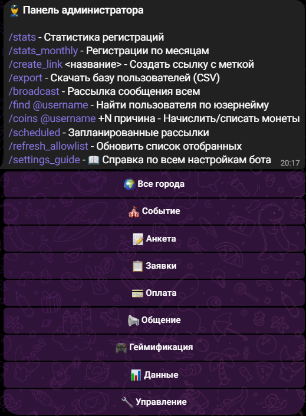

# ⚡ Шпаргалка менеджера

Короткая версия. Подробности — **[ADMIN_GUIDE.md](ADMIN_GUIDE.md)**.
Всё меняется кнопками в Telegram, перезапуск бота не нужен.

`/admin` — девять разделов по пути делегата: **🎪 Событие** · **📝 Анкета** · **📋 Заявки** ·
**💳 Оплата** · **📢 Общение** · **🎮 Геймификация** · **🤝 Амбассадоры** · **📊 Данные** · **🔧 Управление**.
Внутри раздела сверху операции, ниже настройки; «← Назад» возвращает в свой раздел.
Отдельного экрана «⚙️ Настройки форума» больше нет — старая кнопка в давней переписке
открывает тот же список разделов. Не помнишь, где настройка, — **🔧 Управление** →
«🔎 Найти настройку» и одно-два слова («оплата», «аватар»). `/admin` сбрасывает любое
брошенное действие (правку, рассылку, поиск), поэтому следующее сообщение никуда не
«провалится».

*Так выглядит `/admin`: команды текстом, шапка города и восемь разделов. Снимок с тестового
стенда в тёмной теме — у себя увидишь те же кнопки со своими данными.*

## Запустить событие за 6 шагов

1. `/admin` → **📝 Анкета** → «🎛 Тип события (пресет)» → «🏛 Форум» или «🎤 Конференция».
2. `/admin` → **🎪 Событие** → «🎪 Событие/Медиа» — дата, время, место, контакты, приветствие, фото.
3. `/admin` → **📋 Заявки** → «⚙️ Тексты и настройки» — тексты: после регистрации / после одобрения / при отклонении.
4. `/admin` → **📝 Анкета** → «📋 Вопросы регистрации» — докрутить анкету; там же «✏️ Тексты вопросов» — формулировки.
5. Тумблеры: «📝 Регистрация: → 📋 Полная» (в 📝 Анкете); «✅ Полная форма: → 👮 Ручная» и «🔔 Уведомление: → 🕒 Пачкой» (в 📋 Заявках).
6. Пройти регистрацию самому, проверить строку в таблице → выкатывать ссылку.

## Первая настройка события

Десять пунктов нового менеджера — по порядку. Последний — в приложении; остальные девять
делаются кнопками в боте и лежат не глубже трёх нажатий от `/admin`.

Не хочешь держать список в голове — открой приложение → плитка **🚀 Первая настройка**:
мастер проведёт по этим же пунктам по порядку и покажет, что уже задано.

1. **Имя, аватар и описание бота** — `/admin` → **🎪 Событие** → «🖼 Аватар бота» (просто прислать фото); имя и описание — там же, «🎪 Событие/Медиа» → «✏️ 🤖 Имя бота», «✏️ 🪪 Описание бота (до /start)» (текст на пустом экране до `/start`), «✏️ 🪪 Строка «О боте» в профиле». Всё применяется сразу; имя Telegram даёт менять лишь несколько раз подряд — если откажет, бот скажет, через сколько попробовать снова.
2. **Приветствие** — `/admin` → **🎪 Событие** → «🎪 Событие/Медиа» → «✏️ 💬 Приветствие».
3. **Фото приветствия** — тот же экран, кнопка «📷 💬 Фото приветствия» (просто прислать фото).
4. **Инфо о форуме** — тот же экран: «🗓 Дата», «⌚ Время», «📍 Место», «📫 Адрес» (а также фото «📅 Программа», «🗣 Спикеры», «🏢 Площадка»).
5. **Контакты** — там же: «👤 Контакт», «🔵 VK», «🔹 TG».
6. **Кнопки меню делегата** — `/admin` → **🎪 Событие** → «🔘 Кнопки меню»: что делегат видит в меню бота.
7. **Тексты вопросов анкеты** — `/admin` → **📝 Анкета** → «✏️ Тексты вопросов» (`-` — вернуть стандартную формулировку).
8. **Текст после одобрения** — `/admin` → **📋 Заявки** → «⚙️ Тексты и настройки» → «🎉 После одобрения».
9. **Текст при отклонении** — там же, «🚫 При отклонении».
10. **Дата отсчёта до форума** — приложение → «⚙️ Настройки» → поиск по подписи «🗓 Дата отсчёта до форума», формат ДД.ММ.ГГГГ. Без неё в приложении не появится строка «N дней до форума» — или просто открой приложение → 🚀 Первая настройка.

Пункты 8–9 раньше лежали в «📝 Регистрация» — теперь они в «📋 Заявки», рядом с самой
очередью заявок. Если искал их в анкете и не нашёл — вот куда они уехали.

## Первая настройка СкиллАп

Шесть шагов по порядку, специально для форума СкиллАп — до этого пройди «Запустить событие
за 6 шагов» выше (дата, место, приветствие остаются общими для любого события).

Не хочешь держать список в голове — открой приложение → плитка **🚀 Первая настройка**:
мастер проведёт по этим же пунктам по порядку и покажет, что уже задано (шаги СкиллАп мастер
показывает сам, когда выбран тип «🎓 Форум СкиллАп»).

1. **Применить пресет** — `/admin` → **📝 Анкета** → «🎛 Тип события (пресет)» →
   «🎓 Форум СкиллАп» → прочитать, что включится, → «✅ Применить». Одна кнопка настраивает
   вопросы, развилку резюме, догонялку, пропуск «Откуда узнал» по реф-ссылке и включает
   автоматический балл — перезатирает текущие тумблеры вопросов, поэтому ставь его первым.
2. **Проверить списки вариантов** — `/admin` → **📝 Анкета** → «📝 Регистрация»: списки
   «Стек», «Опыт», «Готовность», «Образование» — под своё событие (свои технологии, свои
   формулировки статусов учёбы). Пресет ставит только вопросы включёнными, сами варианты
   ответов не трогает — их заводишь сам, под конкретный форум.
3. **Отметить правила балла** — `/admin` → **📋 Заявки** → «🧮 Правила балла»: чекбоксами
   отметить, какие направления считать IT, какие статусы образования — старшими, какую
   готовность и опыт засчитывать, плюс два порога числом («Курс от», «Стек от»). Без этого
   шага балл будет считаться нулём по этим пунктам — пресет намеренно не трогает эти списки
   (они зависят от вариантов, которые ты завёл на шаге 2).
4. **Задать вайтлист доменов** — `/admin` → **📝 Анкета** → «📝 Регистрация» → «🔗 Проверенные
   сайты для ссылки на резюме» (по умолчанию hh.ru, GitHub, GitLab, LinkedIn, Notion) —
   поправь список, если делегаты твоего события используют другие профильные сайты.
5. **«♻️ Пересобрать таблицу»** — `/admin` → **📊 Данные** → «♻️ Пересобрать таблицу»: заголовок
   листа подтянет новые колонки (Балл, IT 3+, ответы новых вопросов) — без этого шага старые
   строки не выровняются под новый набор колонок.
6. **Прогнать анкету на себе** — зарегистрируйся сам вторым аккаунтом (или попроси коллегу):
   проверь, что резюме принимается всеми тремя способами (файл / ссылка / без резюме), кейс-
   чемпионат спрашивается, а в карточке заявки виден балл и метка «IT 3+».

## Как провести волну

Амбассадорский слой поверх обычной геймификации — задания только для тех, кто позвал друзей
по своей ссылке. Волны, ступени и баллы — в разделе «🤝 Амбассадоры» (пока «🤝 Отбор амбассадоров» выключен, волны и
ступени лежат в «🎮 Геймификации»). Подробности и два ограничения фазы (волны только в чате, баллы за
приглашённого — только при боевом одобрении) — [ADMIN_GUIDE.md, §24](ADMIN_GUIDE.md#24-геймификация-задания-и-баллы).

1. **Создать волну** — `/admin` → **🤝 Амбассадоры** → «🌊 Волны» → «➕ Новая волна» → две
   даты одной строкой через «;» (`01.10.2026; 21.10.2026`). Была прошлая волна — жми
   «📋 Скопировать прошлую» вместо пустой: задания и дедлайны переедут сами. На любом шаге
   «Отмена» отменяет шаг целиком, ничего не сохраняя.
2. **Завести задания волны** — `/admin` → **🎮 Геймификация** → «🎯 Задания» → «➕ Новое задание» → на шаге «Волна?»
   выбрать нужную волну (или «🚫 Вне волн»), на шаге «Кому это задание?» — «Всем делегатам»
   или «Только амбассадорам». Пока волна черновик, её задания никто не видит — донастраивай
   спокойно.
3. **Запустить волну** — «🌊 Волны» → нужная волна → «▶️ Запустить волну». Без единого задания
   или с уже прошедшей датой конца бот запустить не даст, объяснит словами что поправить. В
   дату начала волны каждый действующий на тот момент амбассадор получит одно сообщение со
   списком заданий — до этого момента задания волны никому не видны.
4. **Объявить итоги** — в дату конца волны бот сам пришлёт менеджеру личное сообщение с
   кнопкой «🏁 Объявить итоги»; та же кнопка («🏁 Итоги волны») есть и на карточке волны в
   статусе «ждёт итогов», если сообщение потерялось (или бот в этот момент был выключен —
   сообщение придёт после следующего запуска). Подтверди — список призёров дальше не
   меняется; ничья на границе призовых мест — призёрами станут все, кто её разделил, экран
   подтверждения предупредит заранее.

Штраф за просрочку — один и тот же в чате и в приложении, виден менеджеру до нажатия
«Одобрить» на обеих поверхностях. В текстах волны `{wave}` — только номер волны, слово
«Волна» пишется в самом тексте.

## 🤝 Амбассадоры: вход в команду и места

`/admin` → **🤝 Амбассадоры** → «🚪 Вход и лимит»:

- **Способ входа** — кнопкой: «⚡ Сразу по кнопке» (делегат вступает сам) или «🗳 Отбор
  менеджером» (делегат становится кандидатом, в команду берёте вы). Перед переключением бот
  покажет, что изменится у делегатов; уже вступивших и подавших это не трогает.
- **Мест в команде** — пришлите число, например `17`; `0` — без лимита. Меньше, чем уже
  занято, бот не примет. Место занимает только амбассадор с одобренной заявкой на форум.
- **Тексты для делегатов** — кнопка «✏️ Тексты для делегатов» (нужно право «⚙️ Настройки»).

`/admin` → **🤝 Амбассадоры** → «🙋 Кандидаты и команда» (или кнопка «🙋 Кандидаты: N» на экране
«Вход и лимит»):

- **Списки** — кнопками «🙋 Кандидаты / 🤝 В команде / 📭 Без пакета / 🚫 Отказано», по 10 человек
  на странице. Сверху — «Занято мест: 12 из 17». В строке — город, статус заявки на форум и
  «привёл N / прошли M» (сколько пришло по его ссылке и сколько из них одобрено).
- **Нажмите на человека** → карточка с кнопками:
  - «✅ Взять» — в команду (кандидата, отказанного или вышедшего). Ему придёт текст «тебя взяли»
    со ссылкой (ночью — утром). Место в лимите он получит, если заявка на форум одобрена и места
    есть; иначе — в команде «без пакета», бот скажет почему.
  - «⏸ Не сейчас» — оставить в запасе. Человеку ничего не приходит, в списке он уходит вниз.
  - «🎁 Пакет выдан: да/нет» — отметить, что подарок вручён. С выданным пакетом место остаётся
    за человеком, даже если он выйдет.
  - «🎟 Дать место» — когда у человека из команды одобрили заявку, а место есть.
  - «🚪 Вывести из команды» — через подтверждение: там написано, освободится ли место и какое
    сообщение получит человек.
  - «🧾 Анкета» — его анкета, как в очереди заявок (нужно право модерации заявок).
- **«📥 Выгрузить в таблицу (CSV)»** — все кандидаты и команда с местом, пакетом и статистикой
  приглашений; открывается в Excel и Google Таблицах.
- **«🙅 Вежливо отказать всем оставшимся (N)»** — когда состав команды финальный. Бот покажет,
  скольким уйдёт сообщение и какой текст («✏️ Изменить текст» — поправить его), и отправит только
  после «✅ Отправить N». Ночью сообщения ждут утра, в конце придёт отчёт «отправлено / отложено до
  утра / не доставлено». Кнопки «Хочу стать амбассадором» у отказанных в этом сезоне больше не
  будет, но вернуть человека можно: список «🚫 Отказано» → человек → «✅ Взять». Кнопка видна,
  когда в админке выбраны «Все города»: отказ действует на кандидатов всех городов.
- **«➕ Назначить амбассадором»** — взять в команду любого, кто подал анкету, даже если он не
  просился. Пришлите @ник, ссылку t.me, Telegram ID или перешлите его сообщение; бот покажет
  имя, город, статус заявки и текст, который человек получит, — и назначит после «✅ Назначить».
- **«📎 Закрепить приглашённого»** (`/admin` → **🤝 Амбассадоры**) — когда человек пришёл без
  реф-ссылки, но известно, кто его привёл («пригласила, скрины в чате»). Пришлите, кого привели и
  кто привёл (@ник, ссылка t.me, Telegram ID или пересылка), затем заметку — откуда известно.
  Бот покажет, что изменится: у одобренного зачёт и баллы ложатся сразу, у ожидающего — после
  одобрения. В журнале зачётов такая строка помечена «вручную» с вашим именем и заметкой.
  Перезакрепить уже закреплённого нельзя — зачёт уже у прежнего пригласившего.
- **«🔄 Новый сезон» сбрасывает команду**: у всех амбассадоров статус, место и пакет обнуляются,
  отбор начинается заново. Экран подтверждения сезона пишет, скольким сбросится. Прошлый состав
  не теряется — кнопка **«📥 Прошлые сезоны (CSV)»** здесь же.

## Хочу X → жму Y

| Хочу | Куда идти |
|------|-----------|
| Одобрить/отклонить заявки | `/admin` → **📋 Заявки** → «📋 Заявки» (карточки по одной) |
| Проверить чеки об оплате | `/admin` → **💳 Оплата** → «🧾 Чеки» |
| Написать всем / сегменту | `/admin` → **📢 Общение** → «📢 Рассылка» → «🎯 По фильтру» |
| Отправить письмо в четверг в 10:00 | 📢 Общение → Рассылка → **🕓 Запланировать** (`/scheduled` — посмотреть/отменить) |
| Собрать опрос | `/admin` → **📢 Общение** → «📊 Опросы» |
| Поменять текст «заявка принята» | `/admin` → **📋 Заявки** → «⚙️ Тексты и настройки» → «✅ После регистрации» (переехал из «📝 Регистрация») |
| Поменять текст после одобрения / при отклонении | Там же: «🎉 После одобрения», «🚫 При отклонении» |
| Поменять приветствие, дату, место, контакты | `/admin` → **🎪 Событие** → «🎪 Событие/Медиа» |
| Переименовать кнопку меню делегата | `/admin` → **🎪 Событие** → «✏️ Подписи кнопок меню» → нужная кнопка (пусто — стандартная подпись; старая подпись на клавиатурах делегатов продолжает работать) |
| Сменить имя или аватар бота | `/admin` → **🎪 Событие** → «🖼 Аватар бота» (прислать фото → «✅ Да, поставить»); имя — «🎪 Событие/Медиа» → «🤖 Имя бота» |
| Найти настройку, не помня раздел | `/admin` → **🔧 Управление** → «🔎 Найти настройку» → слово («оплата», «приветствие», «аватар») |
| Текст отклонённому, который снова нажал /start | `/admin` → **🎪 Событие** → «🎪 Событие/Медиа» → «🔄 Приветствие после отказа» |
| Поменять любой другой текст, который видит делегат | Раздел по смыслу: 🎪 Событие (приветствия, заглушки), 📋 Заявки (после подачи), 💳 Оплата, 🎮 Геймификация, 🔧 Управление → 🎨 Оформление (тексты приложения); `{скобки}` в тексте не трогать (`{event}` — название из «🎪 Название мероприятия»), `-` — вернуть стандартный |
| Включить/выключить вопрос анкеты | `/admin` → **📝 Анкета** → «📋 Вопросы регистрации» |
| Включить акционную анкету (6 вопросов) | `/admin` → **📝 Анкета** → «🎛 Тип события (пресет)» → «⚡ Акция», затем там же тумблер «📝 Регистрация: 📋 Полная → ⚡ Краткая» (обратно — той же кнопкой) |
| Настроить форум СкиллАп одной кнопкой | `/admin` → **📝 Анкета** → «🎛 Тип события (пресет)» → «🎓 Форум СкиллАп» — дальше см. «Первая настройка СкиллАп» выше |
| Настроить, какие ответы приносят балл заявки | `/admin` → **📋 Заявки** → «🧮 Правила балла» (чекбоксы по текущим спискам вариантов + два порога числом) |
| Отсортировать очередь заявок по баллу | `/admin` → **📋 Заявки** → тумблер «🧮 Очередь заявок: сначала с высоким баллом» |
| Дать делегату выбор «файл / ссылка / без резюме» | `/admin` → **📝 Анкета** → «📋 Вопросы регистрации» → кнопка-цикл у строки «Резюме», жми пока не станет «→ спросить способ» |
| Переписать формулировку вопроса | `/admin` → **📝 Анкета** → «✏️ Тексты вопросов» (`-` — вернуть стандартную) |
| Поменять список городов/целей/ВУЗов | `/admin` → **📝 Анкета** → «📝 Регистрация» → нужный список |
| Добавить/выключить город мероприятия, ссылки на города | `/admin` → **🔧 Управление** → «🏙 Города мероприятия» |
| Сделать другой набор вопросов для одного города | `/admin` → **📝 Анкета**: выбрать город в шапке, дальше «📋 Вопросы регистрации» / «✏️ Тексты вопросов» — см. раздел ниже |
| Подключить другую Google-таблицу | `/admin` → **📊 Данные** → «🔗 Какая таблица» → «✏️ Указать другую таблицу» → ссылка → «✅ Переключить» (только суперадмин; бот сам проверит доступ и скажет, кого добавить редактором) |
| Переименовать вкладки таблицы | `/admin` → **📊 Данные** → «📄 Вкладки таблицы» (бот предупредит, если вкладка уже есть) |
| Настроить оплату | `/admin` → **💳 Оплата** → «⚙️ Тексты и настройки» (тарифы, реквизиты, дедлайн, штрафы) |
| Добавить согласие с PDF | `/admin` → **📝 Анкета** → «📋 Согласия» (список) + «🧾 PDF согласий» (файлы) |
| Ссылка под канал/афишу/партнёра | `/create_link vk_stories` (латиница, без пробелов) или `/admin` → **📊 Данные** → «🔗 Ссылки с метками» → ➕ Новая ссылка |
| Хочу кнопку дашборда в приложении | Появляется сама в хабе менеджера («📊 Данные»), когда владелец задал адрес дашборда при деплое; подпись плитки ищи в поиске настроек по слову «дашборд» |
| Посмотреть, откуда пришли люди | `/admin` → **📊 Данные** → «📈 Источники» |
| Выгрузить базу | `/admin` → **📊 Данные** → «📄 Экспорт CSV» |
| Починить/обновить таблицу | `/admin` → **📊 Данные**: 🔄 Синхронизация · ♻️ Пересобрать · 🧹 Убрать дубли (остаётся свежая строка; обе раскладывают строки по вкладкам городов, если города включены) |
| «Пропали столбцы» в таблице | Сначала: правый клик по букве столбца → «Показать» (скрытые столбцы) или шире диапазон IMPORTRANGE в копии; потом 📊 Данные → ♻️ Пересобрать |
| Показать таблицу коллегам живой копией | В другой таблице: `=IMPORTRANGE("ссылка"; "TG CANDIDATES!A1:Z10000")` → «Разрешить доступ»; только чтение, без цветов |
| Посмотреть, где бросают анкету | `/admin` → **📊 Данные** → «📝 Незавершённые → таблица» (колонка «Остановился на» + сводка «Где отваливаются») |
| Вопрос делегата «повис» без ответа | `/admin` → **📋 Заявки** → «❓ Вопросы делегатов» → фильтр «В работе» |
| Делегаты спрашивают одно и то же | `/admin` → **📋 Заявки** → «❓ Частые вопросы» → ➕ Добавить |
| Отвеченный вопрос — в FAQ одним нажатием | «❓ Вопросы делегатов» → под ответом кнопка «❓ В FAQ #N» → поправить текст → «✅ Сохранить» |
| Поправить FAQ, не выходя из приложения | Приложение → «❓ Частые вопросы» → пункт → правка / стрелки / «Скрыть» / «Удалить» |
| Найти человека | `/find @username` |
| Начислить баллы | `/admin` → **🎮 Геймификация** → «🪙 Баллы вручную» (кнопками, с «было → станет») или `/coins @username +50 причина`; история — «📜 Ручные начисления» там же |
| Начислить баллы прямо в чате делегатов | Ответить на сообщение делегата «+5 за мем» (нужна роль «🎮 Менеджер геймификации»): бот начислит, поставит 👌 и напишет делегату. Одно сообщение — одно начисление; снять — только в боте, «🪙 Баллы вручную» |
| Перенести баллы, которые считали в таблице | `/admin` → **🎮 Геймификация** → «📥 Перенос баллов из таблицы» → ссылка на вкладку (колонка с @никами + баллы) → «✅ Перенести и написать каждому» / «✅ Перенести без сообщений». Повтор не задваивает |
| Что сейчас включено | `/admin` → **🔧 Управление** → «📖 Справка по настройкам» |
| Добавить менеджера | `/admin` → **🔧 Управление** → «👥 Роли и доступы» → ➕ Добавить менеджера |
| Снять менеджера | Роли и доступы → `➖ Имя — роль` рядом с человеком |
| Выключить роль на время | Роли и доступы → `{роль}: ✅ Вкл → ❌ Выкл` |
| Поменять состав прав роли | Роли и доступы → «✏️ Права роли: …» — чекбоксы, тап сохраняет сразу |
| Дать маркетологу ставить свои метки (без админки) | Роли и доступы → ➕ Добавить менеджера → «📣 Маркетинг (метки)»: в `/admin` у него только **📊 Данные** с «🔗 Ссылки с метками» и «📈 Источники» — метка и число анкет, без имён и контактов |
| Создать задание геймификации | `/admin` → **🎮 Геймификация** → «🎯 Задания» → ➕ Новое задание → … → «👁 Так увидит делегат» → **✅ Опубликовать** |
| Поправить задание (текст, баллы, дедлайн, фото) | 🎮 Геймификация → «🎯 Задания» → ✏️ №N → нужная кнопка; «🗄 В архив» — убрать из списка у делегатов |
| Проверить присланные задания | `/admin` → **🎮 Геймификация** → «🎮 Проверка заданий» (карточки по одной, «Осталось: N») |
| Начислить за задание не фиксированную сумму | В карточке — **✏️ Другая сумма** |
| Посмотреть, кто что сдал | Google-таблица, вкладки «Гейма» и «История сдач» (+ «Город Гейма» по городам); обновляются сами, 🎮 Геймификация → «🔄 Таблица геймы» — пересобрать сейчас |
| Цифры по геймификации | `/admin` → **🎮 Геймификация** → «📊 Статистика геймы» |
| Провести волну амбассадоров целиком | См. «Как провести волну» выше |
| Выбрать амбассадоров из желающих | `/admin` → **🤝 Амбассадоры** → «🙋 Кандидаты и команда» → человек → «✅ Взять» / «⏸ Не сейчас» |
| Выгрузить команду амбассадоров | Там же → «📥 Выгрузить в таблицу (CSV)» |
| Закрыть набор амбассадоров и вежливо отказать остальным | Там же → «🙅 Вежливо отказать всем оставшимся (N)» → «✅ Отправить N» |
| Сделать амбассадором того, кто не просился | Там же → «➕ Назначить амбассадором» → @ник / ID / пересылка → «✅ Назначить» |
| Посмотреть амбассадоров прошлых сезонов | Там же → «📥 Прошлые сезоны (CSV)» |
| Начислять баллы за приглашённых амбассадором | `/admin` → **🤝 Амбассадоры** → «💰 Баллы и приватность» → «💰 Баллов за приглашённого» (0 = выключено) |
| Настроить штраф за просрочку задания | `/admin` → **🎮 Геймификация** → «⚙️ Тексты и настройки» → «⏰ Штраф за сдачу после дедлайна, %» (0 = без штрафа) |
| Скрыть имена в рейтинге волны от других амбассадоров | `/admin` → **🤝 Амбассадоры** → «💰 Баллы и приватность» → «🏅 Имена в рейтинге волны» |
| Скрыть имена приглашённых от самого амбассадора | `/admin` → **🤝 Амбассадоры** → «💰 Баллы и приватность» → «🙈 Скрывать имена приглашённых» |
| Собрать лестницу ступеней (1–5, квота на любой ступени) | `/admin` → **🤝 Амбассадоры** → «🎓 Ступени амбассадоров» → «🪜 Лестница ступеней» → «➕ Добавить ступень» |
| Снять ступень у амбассадора (накрутка, ошибка) | Там же → «🚫 Снять ступень у амбассадора» → «✅ Снять ступень» |
| Вернуть снятую ступень (бот сам её и старшие не выдаст, пока не вернёте) | «🪜 Лестница ступеней» → «↩️ Вернуть ступень» → нажать на человека |
| Отдать освободившееся место из листа ожидания | «🪜 Лестница ступеней» → «🎁 Отдать место · ступень N» → «✅ Отдать место» (бот сам очередь не двигает) |
| Исключить приглашённого за накрутку | `/admin` → **🤝 Амбассадоры** → «🚫 Исключения из зачёта» → приглашённый → причина → «✅ Исключить» (баллы и очки волны снимутся, ступень — отдельно) |
| Закрепить за амбассадором того, кто пришёл без ссылки | `/admin` → **🤝 Амбассадоры** → «📎 Закрепить приглашённого» |
| Включить приложение (кнопка «📱 Приложение» в меню бота) | `/admin` → **🔧 Управление** → «🎨 Оформление» → «Приложение включено» |
| Скрыть приложение от делегатов, оставить только менеджерам | 🔧 Управление → 🎨 Оформление → «Только менеджерам» (у менеджеров запасной вход остаётся). Выключенное «Приложение включено» тоже закрывает его только делегатам — менеджеры входят |
| Выбрать, какие разделы видны в приложении | 🔧 Управление → 🎨 Оформление → чекбоксы разделов (Задания, Баллы, Рейтинг, Профиль, Анкета — делегату; Проверка сдач, 🗂 Задания (менеджер), 🗂 Отбор заявок, Статистика, Настройки — менеджеру) |
| Хочу выключить анкету в приложении | `/admin` → **🔧 Управление** → «🎨 Оформление» → чекбокс «📝 Анкета» (пропадут плитка в хабе, кнопка после приветствия, «✏️ Изменить анкету» в профиле и кнопка в догонялке; сама регистрация в чате не затрагивается) |
| Хочу вернуть изменённые анкеты на проверку | `/admin` → **📋 Заявки** → тумблер «Изменённая анкета — снова на модерацию» (по умолчанию выключен — правка не снимает заявку с одобрения) |
| Хочу посмотреть, что делегат поменял | В карточке заявки — кнопка **«🕓 История»** (появляется, если анкету правили); список «было → стало» по каждому полю |
| Настроить, какие ответы видны в карточке заявки | `/admin` → **📋 Заявки** → «🧾 Поля карточки заявки» (или в приложении: ⚙️ Настройки → «📋 Заявки») — чекбокс на каждый вопрос + лимит длины ответа; один набор и на карточку в чате, и на карточку в приложении |
| Включить отбор заявок «тиндером» в приложении | `/admin` → **🔧 Управление** → «🎨 Оформление» → чекбокс «🗂 Отбор заявок» |
| Добавить/поправить готовую причину отказа заявки | `/admin` → **📋 Заявки** → «✍️ Причины отказа» — список, каждая с новой строки; те же причины видны и в чате, и в приложении |
| Отменить только что принятое решение по заявке (в приложении) | Тост «Отменить» под карточкой — 5 секунд после решения, дальше отменить нельзя (константа, в настройках не меняется) |
| Принять все заявки в очереди сразу (в приложении) | Кнопка «Принять всех N» в шапке экрана «🗂 Отбор заявок» → подтвердить число и город — необратимо |
| Почему у делегата в приложении нет фото, только буквы | Профиль в Telegram закрыт для бота — приложение показывает инициалы вместо аватара, это не ошибка |
| Посмотреть, что спрашивают делегаты, и правки анкет одним листом | `/admin` → **📊 Данные** → «🕓 Журналы в таблицу» (листы «История правок» и «Вопросы», обновляются сами) |
| Сменить оформление приложения (пресет, цвета, шрифт, лого) | 🔧 Управление → 🎨 Оформление → «🎭 Пресеты и ручки оформления» |
| Проверить сдачи / начислить баллы / посмотреть статистику геймы с телефона, без карточек по одной | Кнопка **📱 Приложение** в меню бота — те же права и те же разделы, что и в `/admin` |
| Посмотреть общую картину / открыть веб-дашборд | `/admin` → **📊 Данные** → «📊 Статистика регистраций» → «🌐 Открыть дашборд» (кнопка появляется, только если адрес дашборда настроен при деплое) |
| Выбрать, какие блоки видны на веб-дашборде | `/admin` → **📊 Данные** → «📊 Дашборд» → чекбоксы блоков |
| Начать новый сезон / подтянуть прошлое событие | `/admin` → **🔧 Управление** → «🔄 Новый сезон» (только владелец бота; команда амбассадоров сбрасывается, прошлая — в «📥 Прошлые сезоны (CSV)») · «📥 Импорт прошлого события» |
| Не будить делегата ночью решением/пушем | `/admin` → **📋 Заявки** → тумблер «🌙 Тихие часы» + «с»/«до» текстом (по умолчанию выключено); подробнее — [ADMIN_GUIDE.md, раздел 12](ADMIN_GUIDE.md#12-тихие-часы) |
| Включить новую анкету | `/admin` → **📝 Анкета** → «Анкета мероприятия» → сегмент «Старая / Новая» |
| Вернуть старую анкету | Тот же экран, сегмент назад на «Старая» — ответы делегатов не пропадают |
| Разобрать очередь «Другое» (ВУЗ/город) | `/admin` → **📝 Анкета** → «📚 Справочники» → влить как псевдоним / отклонить |
| Закрепить чипы ВУЗа/города | `/admin` → **📝 Анкета** → «📚 Справочники» → закрепить (до 8) |

## Свой набор вопросов для города

Пять шагов, если одному городу нужны свои вопросы, свои формулировки или короткое резюме
текстом вместо файла — остальным городам это не мешает.

1. `/admin` → **📝 Анкета** → в шапке раздела выбрать нужный город («🏙 Город: …»).
2. «📋 Вопросы регистрации» — выключить лишние вопросы. У выключенного появится пометка, что
   это своё значение для города, а не как везде.
3. «✏️ Тексты вопросов» — переписать формулировку нужного вопроса. Там же кнопка
   «↩️ Как везде» — вернуть общий текст, если своя формулировка больше не нужна.
4. При необходимости — переключить режим резюме на «только текст» (там же, в «📋 Вопросы
   регистрации», у строки резюме).
5. `/admin` → **📊 Данные** → «♻️ Пересобрать таблицу» — иначе колонки старых строк этого
   города не сдвинутся под новый набор вопросов.

**Кейс СПб/Тюмени** (запрос менеджера этих городов): для города выключить «📋 Форматы
форума» и «🎯 Цель участия», переписать текст вопроса «Ожидания» в объединённый вопрос
«Ожидания от форума», режим резюме переключить на «только текст». «Слияние» двух вопросов
в один — это не отдельная функция, а именно эта конфигурация: один вопрос выключается,
второй меняет текст. Отдельной кнопки «объединить вопросы» в боте нет и не будет.

## Бот делает сам

- Догоняет бросивших анкету (≈через 2 часа, один раз). Как часто проверять — «🔧 Система»; новый интервал, как и у других фоновых задач, действует сразу.
- Напоминает об оплате за 3 и за 1 день до дедлайна, снимает напоминания после чека.
- Раз в 30 минут шлёт сводку «Заявок в ожидании: N».
- При включённых «🌙 Тихих часах» откладывает пуши делегату до конца окна, но не свою сводку.
- Пишет каждую регистрацию в Google-таблицу и проставляет статус заявки цветом.
- Складывает резюме в облако, в таблицу кладёт ссылку.

## Две ссылки — не путать

- **`/create_link <метка>`** — для каналов, афиш, партнёров. Регистрации считаются по
  метке, вопрос «откуда узнал» таким людям не задаётся.
- **«🔗 Моя реферальная ссылка»** — кнопка в меню, есть у каждого участника. Кто пришёл по
  ней, закрепляется за пригласившим. Для амбассадоров.

## Красные флажки

- **Три кнопки стирают лист целиком** и перезаписывают из базы: ♻️ Пересобрать · 🧹 Убрать
  дубли · 🔄 Таблица геймы. Каждая сначала спросит подтверждение — прочитай его. Пропадёт
  только то, чего нет в базе бота: **заметки, дописанные руками прямо в листе.**
- **Дедлайн задания мягкий:** после срока бот всё равно принимает сдачу, в карточке она
  помечена «⏰ Сдано после дедлайна» — начислять баллы или нет, решаешь ты.
- **Исключение за накрутку не снимает уже выданную ступень** — её снимаете вы отдельно
  кнопкой «Снять ступень».
- **Волны и амбассадорские задания живут только в чате** — в приложении своих экранов у
  них пока нет.
- **Баллы за приглашённого капают только от боевого одобрения** (карточка модерации,
  «Принять всех», авто-одобрение) — тестовый статус из команды `/uat` баллов не даёт, это
  не поломка.
- **Кнопка «🎯 Задания» не появится у делегатов сама** — у тех, кто уже пользовался ботом,
  меню обновится только после `/start`. Нужна рассылка с просьбой перезапустить.
- **Кнопка «📱 Приложение» ведёт себя так же** — новым делегатам видна сразу, старым только
  после `/start`; выключенный тумблер «Приложение включено» — и бот вместо приложения
  показывает делегату короткое объяснение, что оно сейчас недоступно. Менеджеры входят и в
  выключенное приложение.
- **В текстах настроек `{скобки}` — не украшение:** туда бот подставляет числа и имена.
  Удалишь — делегат увидит текст без цифры.
- **Переименовывать вкладку регистраций в таблице нельзя** — бот привязан к её имени и после
  переименования начнёт писать в новую вкладку с прежним названием. Это задача разработчику.
- **Смена набора вопросов у одного города меняет ширину только ЕГО вкладки** — старые строки
  этой вкладки сами не сдвинутся, нужна «♻️ Пересобрать таблицу» (она же стирает ручные
  заметки в листе, как написано выше).
- Цвета и выпадашки **не переносятся через IMPORTRANGE** — подключай инструменты к рабочей
  таблице напрямую.
- На телефоне Enter отправляет сообщение: многострочные списки вводи через `;`.
- Кастомные эмодзи Premium бот пересылать не может — ограничение Telegram.
- При 1000+ заявках держи уведомления в режиме «Пачкой».
- Право «⚙️ Настройки» равно админскому (даёт доступ к «👥 Роли и доступы» в разделе
  🔧 Управление) — не выдавай его «просто чтобы поправил текст».

## Внешние формы (Яндекс / Google)

- **Подключить форму:** 📊 Данные → 📝 Внешние формы → «➕ Подключить Яндекс Форму» / «➕ Подключить Google Форму».
- **Вход в Яндекс (один раз):** «🔑 Войти через Яндекс» → «Разрешить» → прислать код боту.
- **Ответы человека:** /find → «📝 Ответы форм».
- **Кому напомнить:** Рассылки → фильтры → «📝 Внешняя форма» → «❌ Не заполнил».
- **Ответы не идут:** Яндекс Формы → Интеграции → «Выполненные интеграции»; для Google — доступ «Читатель» сервисному аккаунту.
- **Согласие на ПД** в чужой форме — на том, кто её создал.

Баг-репорт: **что делал → что ожидал → что произошло** + скриншот.
