# 🛠 Гайд менеджера: как вести мероприятие через бота

Полная версия. Нужна одна страница — смотри **[ADMIN_CHEATSHEET.md](ADMIN_CHEATSHEET.md)**.
Чек-лист «что потыкать перед запуском» — **[BOT_GUIDE.md](BOT_GUIDE.md)**.
Техническая часть (установка, `.env`, архитектура) — **[README.md](../README.md)**.

Всё, что описано ниже, меняется **кнопками в Telegram**. Перезапускать бота и звать
разработчика не нужно — изменения видны участникам сразу.

---

## Оглавление

- [1. Как бот работает](#1-как-бот-работает)
- [2. Запуск события за 6 шагов](#2-запуск-события-за-6-шагов)
- [3. Админ-панель](#3-админ-панель)
- [4. Настройка события](#4-настройка-события)
- [5. Анкета](#5-анкета)
- [6. Тексты участникам](#6-тексты-участникам)
- [7. Модерация заявок](#7-модерация-заявок)
- [8. Оплата и чеки](#8-оплата-и-чеки)
- [9. Согласия](#9-согласия)
- [10. Рассылки](#10-рассылки)
- [11. Автонапоминания](#11-автонапоминания)
- [12. 🌙 Тихие часы](#12-тихие-часы)
- [13. Аналитика: метки и рефералки](#13-аналитика-метки-и-рефералки)
- [14. Google-таблица](#14-google-таблица)
- [15. Резюме и облако](#15-резюме-и-облако)
- [16. Коины и рейтинг](#16-коины-и-рейтинг)
- [17. Предотбор по списку](#17-предотбор-по-списку)
- [18. Трек «вечеринка»](#18-трек-вечеринка)
- [19. Краткая форма (акция)](#19-краткая-форма-акция)
- [20. Грабли и ограничения](#20-грабли-и-ограничения)
- [21. Чего пока нет](#21-чего-пока-нет)
- [22. Города мероприятия](#22-города-мероприятия)
- [23. Роли и доступы](#23-роли-и-доступы)
- [24. Геймификация: задания и коины](#24-геймификация-задания-и-коины)
- [25. Новый сезон и вернувшиеся делегаты](#25-новый-сезон-и-вернувшиеся-делегаты)
- [26. Mini App: приложение для менеджера и делегата](#26-mini-app-приложение-для-менеджера-и-делегата)
- [27. Веб-дашборд статистики](#27-веб-дашборд-статистики)
- [Приложение: анкета Юлид ’26 тумблерами](#приложение-анкета-юлид-26-тумблерами)

---

## 1. Как бот работает

Один бот обслуживает любое мероприятие АЙСЕК — и форум (Юлид), и конференцию
(RusCo/Summit). Разница между событиями — только в настройках, код один и тот же.

Путь участника:

```
/start → анкета → заявка → модерация (или авто-одобрение) → [оплата] → меню участника
```

Что происходит параллельно:

- каждая регистрация пишется в **SQLite** (основа) и дублируется в **Google-таблицу**;
- резюме улетает в **облако**, в таблицу попадает ссылка;
- бот сам догоняет тех, кто бросил анкету, и напоминает про оплату.

---

## 2. Запуск события за 6 шагов

1. `/admin` → **📝 Анкета** → **🎛 Тип события (пресет)** → «🏛 Форум» или
   «🎤 Конференция». Пресет разом включает нужные вопросы и модуль оплаты.
2. `/admin` → **🎪 Событие** → **🎪 Событие/Медиа** — дата, время, площадка, адрес, контакт,
   ссылки на VK/TG, приветствие, фото (программа, спикеры, площадка).
3. `/admin` → **📋 Заявки** → **📋 Заявки** — тексты «после регистрации», «после одобрения»,
   «при отклонении».
4. `/admin` → **📝 Анкета** → **📋 Вопросы регистрации** — докрутить анкету под своё событие;
   там же **✏️ Тексты вопросов** — переписать формулировки.
5. `/admin` → **📝 Анкета** → тумблер «📝 Регистрация: … → 📋 Полная»; модерация — `/admin` →
   **📋 Заявки** → тумблер «✅ Полная форма: ⚡ Авто → 👮 Ручная».
6. Пройти регистрацию самому (у админа есть кнопка «🔄 Пройти регистрацию заново»; при
   включённых городах она сначала спросит город — тот же путь, что у делегата), проверить,
   что строка легла в таблицу. После этого выкатывать ссылку.

---

## 3. Админ-панель

Скриншоты ниже сняты с тестового стенда в тёмной теме Telegram: название события, город и
цифры на них тестовые, а цвета зависят от темы, которая стоит у тебя. Кнопки и их порядок
у себя увидишь те же самые.

`/admin` → панель из **восьми разделов**. Разделы идут по пути делегата: узнал о событии →
заполнил анкету → ждёт решения → платит → получает рассылки → играет; «Данные» и
«Управление» — хвост для менеджера.

Внутри каждого раздела одинаковый порядок: **сверху операции** (то, что делаешь прямо
сейчас), **ниже настройки** (тумблеры, под-экраны, группы текстов). «← Назад» с любого
экрана возвращает в его раздел, а не на общий корень.


*Корень `/admin`: список команд, под ним шапка города («🌍 Все города») и восемь разделов
в порядке пути делегата.*

### 🎪 Событие

Всё, что делегат видит до регистрации: дата, время, место, адрес, контакты, приветствия,
фото и файлы («🎪 Событие/Медиа») · «🔘 Кнопки меню» · тумблер бонуса за регистрацию.

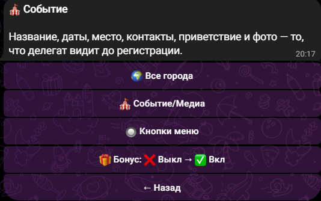

*Под шапкой города — «🎪 Событие/Медиа» и «🔘 Кнопки меню», внизу тумблер «🎁 Бонус».*

### 📝 Анкета

«🎛 Тип события (пресет)» · «📋 Вопросы регистрации» · «✏️ Тексты вопросов» · «🧾 PDF
согласий» · тумблеры формы (краткая/полная, ВУЗ, нумерация, вечеринка, согласия) · списки
вариантов и тексты («📝 Регистрация», «🎉 Party», «📋 Согласия»).

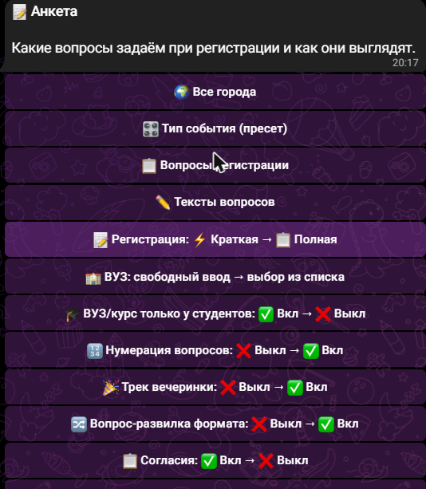

*Верх экрана: сначала под-экраны вопросов, ниже тумблеры. Тумблер подписан как действие:
«📝 Регистрация: ⚡ Краткая → 📋 Полная» читается «сейчас краткая, нажму — станет полной».*

### 📋 Заявки

📋 Заявки · ❓ Вопросы делегатов · 🧾 Поля карточки заявки · тумблеры модерации, уведомлений,
предотбора, сводки, догонялки и повторной модерации изменённых анкет · тексты после подачи
(«📋 Заявки»).

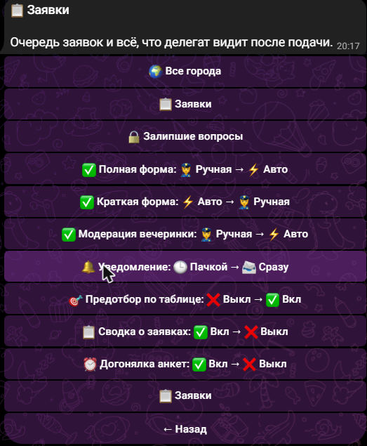

*Сверху сама очередь и журнал вопросов делегатов, посередине тумблеры, в самом низу — группа
текстов с тем же названием «📋 Заявки»: то, что делегат читает после подачи.*

#### ❓ Вопросы делегатов

Журнал ВСЕХ вопросов из кнопки «Задать вопрос» — не только тех, что «повисли». У каждого
вопроса один из трёх статусов:

- **🆕 без ответа** — никто ещё не взял вопрос в работу;
- **✍️ в работе** — кто-то из менеджеров взял вопрос, но ответ ещё не дошёл до делегата
  (обрыв связи, делегат заблокировал бота и т.п.); дольше 30 минут в этом статусе — вопрос
  помечается «🔒 залип»;
- **✅ отвечен** — ответ доставлен, экран показывает текст ответа, кто ответил и когда.

Фильтры-кнопки наверху экрана переключают между «Все» / «Без ответа» / «В работе» /
«Отвечены»; страница — до 6 вопросов, листается ⬅️ ➡️. Кнопка «✉️ Ответить #N» под
неотвеченным или залипшим вопросом открывает поле ввода прямо в этом же чате — ответ уходит
делегату тем же путём, что и обычный reply на карточку вопроса, без необходимости искать
старую карточку в истории переписки.

Старая кнопка «🔒 Залипшие вопросы» переехала сюда же — это тот же экран с включённым
фильтром «В работе».

### 💳 Оплата

🧾 Чеки · тумблеры модуля оплаты и автонапоминаний · тарифы, реквизиты, дедлайн, штрафы
(«💳 Оплата»).

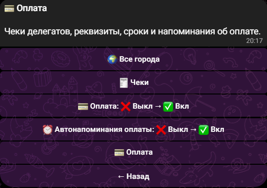

*На снимке модуль оплаты выключен — тумблеры предлагают его включить; суммы, реквизиты и
тексты лежат в группе «💳 Оплата» внизу.*

### 📢 Общение

📢 Рассылка · 📊 Опросы.

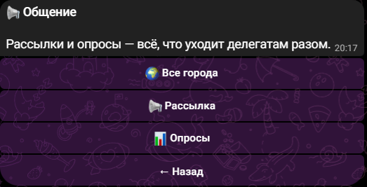

*Самый короткий раздел: две операции и «← Назад». Настраивать в нём нечего — вступление к
опросу живёт в «🎪 Событие», вкладка выгрузки ответов — в «📊 Данные».*

### 🎮 Геймификация

🎯 Задания · 🎮 Проверка заданий · 🪙 Монеты вручную · 📜 Журнал монет · 🔄 Таблица геймы ·
📊 Статистика геймы · тексты экранов геймы («🎮 Геймификация»).

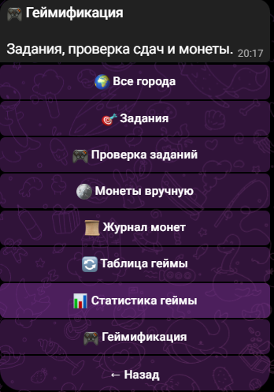

*Шесть операций подряд, последней кнопкой — группа текстов «🎮 Геймификация»: что делегат
читает на экранах заданий и баланса.*

### 📊 Данные

📊 Статистика регистраций · 🗓 Регистрации по месяцам · 📈 Источники · 📄 Экспорт CSV ·
📝 Незавершённые → таблица · 🔄 Синхронизация таблицы · ♻️ Пересобрать таблицу · 🧹 Убрать
дубли из таблицы · «🕓 Журналы в таблицу» · «📄 Вкладки таблицы» · «📊 Дашборд».

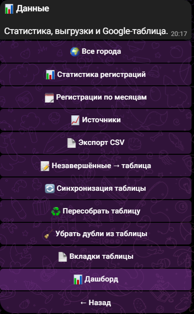

*Самый длинный список: сначала цифры и выгрузки, ниже обслуживание Google-таблицы. Три
кнопки отсюда переписывают лист целиком — §13.*

### 🔧 Управление

🏙 Города мероприятия · 📖 Справка по настройкам · «👥 Роли и доступы» · «🎨 Оформление» ·
«🔄 Новый сезон» (только владелец бота) · «📥 Импорт прошлого события» · «🔧 Система».

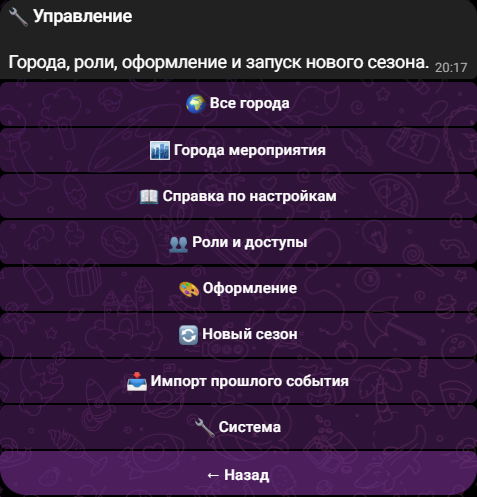

*Хвост для менеджера: города, права, оформление приложения и переход к новому событию.*

Что где лежит подробно — §4.

Кнопки показываются по правам: менеджер без права на геймификацию кнопок геймы не увидит
(§22). **И сам раздел не показывается, если внутри нет ни одной доступной кнопки** — менеджер
регистраций видит на корне только «📋 Заявки», а не восемь разделов, семь из которых
ответят «недоступно».

**Если в старой переписке нажать «⚙️ Настройки форума»** — кнопка из клавиатуры, которую бот
нарисовал до перестройки, — откроется тот же список разделов с пояснением, что настройки
переехали внутрь них. Бот не сломался, просто кнопки в старых сообщениях живут вечно.

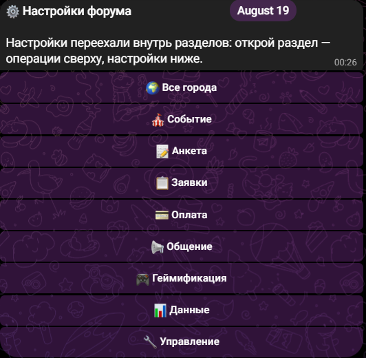

*Так отвечает кнопка из августовской переписки: заголовок остался прежним, а под ним — та
же строка про переезд и те же восемь разделов. Ничего не пропало, жать можно смело.*

То же самое, без диалога с ботом, — в **Mini App** (§25): менеджерский хаб сгруппирован теми
же разделами (🎮 Геймификация, 📊 Данные, 🔧 Управление), у делегата свои экраны заданий,
монет и рейтинга.

Команды (то же самое текстом):

| Команда | Что делает |
|---------|------------|
| `/admin` | Панель |
| `/stats`, `/stats_monthly` | Статистика |
| `/export` | CSV |
| `/broadcast` | Рассылка |
| `/find @username` | Найти участника |
| `/create_link vk_stories` | Ссылка с меткой источника |
| `/coins @username +50 причина` | Начислить/списать монеты |
| `/scheduled` | Запланированные рассылки (и отмена) |
| `/refresh_allowlist` | Перечитать список отобранных из таблицы |
| `/settings_guide` | Справка по настройкам |

Суперадмины — те, чьи Telegram ID указаны в `.env` (`ADMIN_IDS`); остальных менеджеров с
нужными правами заводят прямо из бота — «👥 Роли и доступы», §22.

---

## 4. Настройка события

Отдельного экрана «все настройки списком» больше нет: **настройки живут внутри разделов**.
Открываешь раздел — сверху операции, ниже его тумблеры, под-экраны и группы текстов.

| Раздел | Что в нём настраивается |
|--------|-------------------------|
| 🎪 Событие | Группа **«🎪 Событие/Медиа»**: дата, время, место, адрес, контакт, VK, TG, приветствия (обычное, для зарегистрированных, для вернувшихся), название и сезон события, тип события, заглушки информационных кнопок, «задать вопрос», вступление к опросу, фото (программа / спикеры / приветствие / площадка) и файл бонуса. Отдельно: **«🔘 Кнопки меню»** — какие пункты видит делегат в меню бота; тумблер **«🎁 Бонус»** |
| 📝 Анкета | **«🎛 Тип события (пресет)»**, **«📋 Вопросы регистрации»**, **«✏️ Тексты вопросов»**, **«🧾 PDF согласий»**; тумблеры формы: «📝 Регистрация: краткая/полная», «🏫 ВУЗ», «🎓 ВУЗ/курс только у студентов», «🔢 Нумерация вопросов», «🎉 Трек вечеринки», «🔀 Вопрос-развилка формата», «📋 Согласия»; группы **«📝 Регистрация»** (списки вариантов: города, направления, цели, форматы, источники, ВУЗы, развилка городов), **«🎉 Party»**, **«📋 Согласия»** |
| 📋 Заявки | Операции: **📋 Заявки**, **🔒 Залипшие вопросы**, **🧾 Поля карточки заявки** (какие ответы показывать в карточке и лимит длины ответа). Тумблеры: «✅ Полная форма», «✅ Краткая форма», «✅ Модерация вечеринки», «🔔 Уведомление», «🎯 Предотбор по таблице», «📋 Сводка о заявках», «⏰ Догонялка анкет», «Изменённая анкета — снова на модерацию». Группа **«📋 Заявки»** — тексты «✅ После регистрации», «🎉 После одобрения», «🚫 При отклонении», «⏳ Заявка на рассмотрении», тексты и ссылка предотбора, текст и порог догонялки, тайминг сводки |
| 💳 Оплата | Операция **🧾 Чеки**; тумблеры «💳 Оплата» и «⏰ Автонапоминания оплаты»; группа **«💳 Оплата»** — тарифы, реквизиты (общие и по ЛК), дедлайн, тексты напоминаний и экранов оплаты, штрафы за отмену |
| 📢 Общение | Операции **📢 Рассылка** и **📊 Опросы**. Своих настроек у раздела нет: вкладка выгрузки опросов живёт в «📊 Данные → 📄 Вкладки таблицы», вступление к опросу — в «🎪 Событие» |
| 🎮 Геймификация | Операции **🎯 Задания**, **🎮 Проверка заданий**, **🪙 Монеты вручную**, **📜 Журнал монет**, **🔄 Таблица геймы**, **📊 Статистика геймы**; группа **«🎮 Геймификация»** — тексты экранов заданий и баланса, подписи категорий и типов подтверждения, быстрые суммы монет, лимит перезаливов, режим уведомлений о сдачах |
| 📊 Данные | Операции: **📊 Статистика регистраций**, **🗓 Регистрации по месяцам**, **📈 Источники**, **📄 Экспорт CSV**, **📝 Незавершённые → таблица**, **🔄 Синхронизация таблицы**, **♻️ Пересобрать таблицу**, **🧹 Убрать дубли из таблицы**, **«🕓 Журналы в таблицу»** (листы «История правок» и «Вопросы»). Настройки: группа **«📄 Вкладки таблицы»** (имена вкладок — основная, краткая, Party, незавершённые, гейма, опросы, отобранные, история правок, вопросы — и приписки вкладок по городам) и **«📊 Дашборд»** — какие блоки показывать на веб-дашборде (§26) |
| 🔧 Управление | Операции **🏙 Города мероприятия** (§21) и **📖 Справка по настройкам**. Настройки: **«👥 Роли и доступы»** (§22), **«🎨 Оформление»** — Mini App и его пресеты (§25), **«🔄 Новый сезон»** (только владелец бота) и **«📥 Импорт прошлого события»** (§24), группа **«🔧 Система»** — тайминги резервного прокси и фоновых задач |

⚠️ **Тексты заявок переехали.** «✅ После регистрации», «🎉 После одобрения», «🚫 При
отклонении» и «⏳ Заявка на рассмотрении» раньше лежали в группе «📝 Регистрация» вперемешку
со списками вариантов вопросов — теперь они **переехали из «📝 Регистрация»** в собственную
группу «📋 Заявки» внутри раздела **📋 Заявки**, рядом с самой очередью. Ключи и уже
записанные тексты не изменились: если ты их настраивал, всё на месте, изменился только адрес
кнопки. Это единственная перекладка настроек за всю перестройку — остальные группы переехали
в разделы целиком, как были.

**Как редактировать:** ✏️ — текст, 📷 — фото, 📎 — файл. Отправить `-` — очистить поле.
«❌ Отмена» или `/cancel` — выйти без изменений.

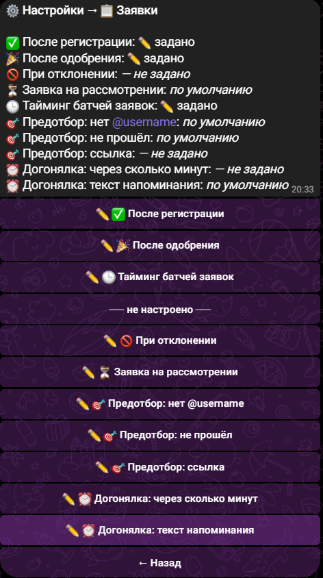

*Экран любой группы устроен одинаково: сверху бот перечисляет все её значения и их
состояние («задано», «по умолчанию», «не задано»), ниже те же значения кнопками — сначала
заполненные, после разделителя «— не настроено —» те, до которых руки не дошли.*

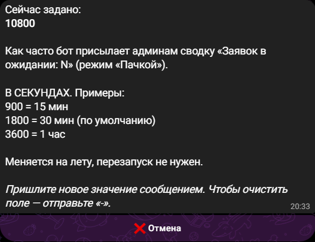

*Нажал ✏️ — и бот сначала показывает, что записано сейчас, объясняет своими словами, на
что это влияет, и приводит примеры формата. Дальше просто присылаешь новое значение
сообщением.*

**Тип события (пресет)** (`/admin` → **📝 Анкета** → «🎛 Тип события (пресет)») — одна
кнопка вместо тридцати:

| Пресет | Что включает |
|--------|--------------|
| 🏛 Форум (Юлид) | Возраст, ВК, источник, образование/ВУЗ/курс/направление, работа, навыки, ожидания. Оплата — выкл |
| 🎤 Конференция (RusCo) | Возраст, ВК, телефон, ЛК, департамент, роль в АЙСЕК, английский, аллергии, питание, приезд, проживание, трансфер, CC-shop, ожидания, волонтёрство. Оплата — вкл |
| 🎉 Party | Возраст, телефон, ВК, город, аллергии, питание — только для трека вечеринки |

⚠️ Пресет **перезатирает** текущие тумблеры вопросов. Ставим его первым, донастраиваем после.

---

## 5. Анкета

**📋 Вопросы регистрации** — включить/выключить любой из ~43 вопросов. Вопросы разбиты по
категориям; сверху переключатель треков **Полный | Party | ⚡ Краткая**. Каждый трек хранит
свой набор: правка в одном не задевает остальные (см. §17 про вечеринку, §18 про акцию).

**✏️ Тексты вопросов** — переписать формулировку любого вопроса под своё событие
(«Введи ФИО» вместо «Как тебя зовут?»). `-` — вернуть стандартную.

**Списки вариантов** (`/admin` → 📝 Анкета → «📝 Регистрация») — города, направления обучения, цели
участия, форматы форума, источники, база ВУЗов. Каждый вариант — с новой строки.
Кнопка «Другое» добавляется сама.

Типы вопросов, которые умеет бот:

- кнопочный выбор (город, образование, курс);
- свободный текст (ФИО, ВУЗ, комментарии) с валидацией email/телефона;
- дата (`ДД.ММ.ГГГГ`) — бот проверяет формат;
- мультивыбор галочками («Цель участия», «Форматы») + кнопка «Готово»;
- файл (резюме PDF/DOCX) или резюме текстом;
- согласия с PDF.

Умные пропуски: ответил «не учусь» — не спросит ВУЗ и курс; формат «Online» — пропустит
неформальный день; трек «без ночёвки» — пропустит вопросы про проживание.

В конце участник видит **сводку ответов**: «Всё верно» или «Изменить» (анкета заново).

Та же анкета целиком доступна и в Mini App («📝 Анкета» в хабе делегата, §25). Анкета в
каждый момент открыта **ровно в одном месте** — правило «одной активной поверхности», см.
раздел «Анкета в чате и в приложении» ниже.

---

### Анкета в чате и в приложении

Делегат заполняет анкету либо в чате с ботом, либо в приложении — никогда в двух местах
сразу («кто будет заполнять анкету и там и там — бред», решение владельца 04.09). Переход
между чатом и приложением — только по явному действию делегата:

- открыл приложение и нажал **«📱 Забрать сюда»** — анкета теперь в приложении, бот на любой
  текст отвечает «анкета открыта в приложении» с кнопкой возврата;
- написал боту (или нажал **«✍️ Продолжить в чате»**) — анкета вернулась в чат, ровно на тот
  вопрос, на который ещё не ответили.

Менеджеру делать для этого ничего не нужно — механика работает сама. Тексты переходов
(группа **📝 Анкета → «📝 Регистрация»**, пять ключей `reg_handoff_*` + два ключа
приложения `reg_form_held_by_bot_text`/`reg_form_takeover_cta_text`) можно поправить как
любой другой текст бота — на смысл переключения это не влияет.

---

## 6. Тексты участникам

Три ключевых текста настраиваются в **`/admin` → 📋 Заявки → «⚙️ Тексты и настройки»** (раньше они
лежали в «📝 Регистрация» — переехали из «📝 Регистрация» вместе с остальными текстами
после подачи, см. §4):

| Кнопка | Когда участник это увидит |
|--------|---------------------------|
| ✅ После регистрации | Сразу после отправки анкеты |
| 🎉 После одобрения | Когда менеджер нажал «✅ Одобрить» |
| ✅ После автоприёма (без модерации) | Заявку приняли СРАЗУ, без проверки менеджером (например, короткая форма с автоодобрением) — своя причина принятия, не «прошёл отбор» (отбора не было). Пусто — возьмётся текст «🎉 После одобрения» |
| 🚫 При отклонении | Когда менеджер нажал «❌ Отклонить» (перед причиной, если указана) |

Поддерживается HTML-разметка (`<b>жирный</b>`, ссылки).

**Это касается не только трёх текстов.** Всё, что делегат читает в боте — приветствие,
развилка городов, тексты оплаты и «чек получен», заглушки «программа ещё не загружена»,
подсказки в заданиях геймификации, заголовок баланса, рейтинг, рефералка, экраны Mini App
(пустые списки, «сессия истекла», «приложение недоступно») — лежит в настройках, а не в коде.
Ищите в разделе по смыслу: **🎪 Событие** → «🎪 Событие/Медиа» (приветствия, заглушки,
«задать вопрос»), **📋 Заявки** → «⚙️ Тексты и настройки» (после заявки / одобрения / отклонения,
«на рассмотрении»), **📝 Анкета** → «📝 Регистрация» (списки вариантов, развилка городов),
**💳 Оплата** → «⚙️ Тексты и настройки» (тексты тарифов, реквизитов, «оплачу позже»),
**🎮 Геймификация** → «⚙️ Тексты и настройки» (экраны заданий, сдачи, баланса),
**🔧 Управление** → «🎨 Оформление» (тексты и пустые состояния Mini App, см. §25). У каждого текста есть стандартный вариант —
отправить `-` вернёт его.

Два правила:

- **Фигурные скобки не трогать.** `{balance}`, `{rank}`, `{count}` и т.п. — место, куда бот
  подставит число или имя; подсказка под каждым текстом перечисляет, что именно. Удалите —
  делегат увидит текст без цифры.
- **HTML — там, где подсказка говорит «Поддерживается HTML».** В таких текстах жирный/курсив,
  набранные прямо в Telegram, сохранятся; в остальных текст уйдёт как есть.

### Готовые шаблоны Юлид ’26

**После регистрации:**

> Поздравляем, твоя заявка принята!
> Мы рассмотрим её в течение 2–3 дней и напишем сюда. Следи за обновлениями 🔥
> Вопросы — задавай прямо здесь.
> Команда Юлид ’26 🧡💙

**После одобрения:**

> Поздравляем, ты прошёл(-ла) отбор на Юлид 2026! 🎊
> Форум пройдёт 30–31 октября в Москве.
> Что дальше: следи за обновлениями в боте — здесь появятся детали программы, треки,
> возможности от партнёров и задания за монеты Юлид.
> Если ты прикрепил(-а) резюме, мы используем его для карьерных возможностей от партнёров.
> До встречи на Юлид 2026 🧡💙

**При отклонении:**

> Спасибо за твою заявку на Юлид 2026.
> Мы внимательно её рассмотрели, но сейчас не можем пригласить тебя на форум — количество
> мест ограничено, и мы отбираем участников по соответствию целям программы.
> Что дальше: следи за новостями Юлида, участвуй в открытых активностях, подавайся на
> следующие форматы.
> Надеемся увидеть тебя в следующих проектах 🧡💙

---

## 7. Модерация заявок

**📋 Заявки** — заявки показываются по одной карточкой, как в Tinder: все данные на экране,
внизу кнопки.

| Кнопка | Действие |
|--------|----------|
| ✅ Одобрить | Участник получает текст «после одобрения» и меню (или переходит к оплате) |
| ❌ Отклонить | Можно указать причину — она уйдёт участнику |
| ⏭ Пропустить | Заявка остаётся в очереди, показывается следующая |
| 📎 Резюме | Открыть приложенный файл прямо в чате |
| ✅ Одобрить все (N) | Массовое одобрение с подтверждением |

При включённом модуле городов очередь и «Одобрить все» работают **в рамках выбранного в
шапке города** — см. раздел «21. Города мероприятия → Город в админке».

Модерация включается отдельно для краткой и полной формы — тумблеры «✅ Полная форма» и
«✅ Краткая форма» в разделе **📋 Заявки**: *Вручную* — заявка ждёт решения, *Авто* —
участник проходит сразу.

**Уведомления о новых заявках**: там же тумблер «🔔 Уведомление» — *сразу* (сообщение на
каждую заявку) или *пачкой* (одна сводка «Заявок в ожидании: N» раз в 30 минут). При
1000+ заявках держим «пачкой», иначе чат утонет.

Статус заявки автоматически проставляется в Google-таблице (Новая / Одобрена / Отклонена),
с выпадающим списком и цветом.

**Правка уже поданной анкеты.** Делегат может поправить свои ответы — из чата (если хоть
раз регистрировался в этом сезоне) или из Mini App, кнопкой «✏️ Изменить анкету» в профиле
приложения (§25). В карточке заявки это видно сразу: пометка **«✏️ Изменена {дата}»** и
кнопка **«🕓 История»**, которая открывает список «было → стало» по каждому изменённому
полю. Если поправил **отклонённый** делегат — вместо этого в карточке пометка
**«🔁 Повторная подача»**, и заявка возвращается в очередь заявок как новая.

По умолчанию правка **одобренной** анкеты статус не меняет — заявка остаётся «Одобрена»,
только добавляется пометка в карточке. Если нужно, чтобы любая правка снова уходила на
проверку, включи тумблер **«Изменённая анкета — снова на модерацию»** (там же, в
«📋 Заявки»): тогда правка переводит статус в «Ждёт проверки» и менеджерам города приходит
уведомление, как о новой заявке.

**Какие ответы показывать в карточке.** Экран **«🧾 Поля карточки заявки»** (там же, в
«📋 Заявки») — чекбокс на каждый вопрос анкеты, нажатие сохраняется сразу; ниже пять готовых
вариантов длины одного ответа (от 200 символов до «не обрезать»). Если даже с обрезкой
ответы не влезают в одно сообщение Telegram, под карточкой появляется кнопка
**«📄 Полная анкета»** — она присылает все ответы отдельными сообщениями целиком, без
обрезки.

---

## 8. Оплата и чеки

Модуль включается тумблером **«💳 Оплата»** в разделе **💳 Оплата** (или пресетом
«Конференция»).

Настройка в **`/admin` → 💳 Оплата → «⚙️ Тексты и настройки»**:

| Поле | Формат |
|------|--------|
| 💳 Варианты оплаты | `Название \| Цена`, каждый с новой строки. Цена `0` = бесплатно. Один вариант — участник его не выбирает |
| 💰 Реквизиты оплаты | Банк, карта, ФИО получателя — обычный текст |
| 💳 Реквизиты по ЛК | `Название ЛК \| реквизиты` — каждый комитет собирает на свою карту |
| 📅 Дедлайн оплаты | `ДД.ММ.ГГГГ ЧЧ:ММ` — от него считаются напоминания |
| ⚠️ Штрафы за отмену | `дата \| сумма`, по строке на дату |

Как это выглядит у участника: после одобрения — выбор тарифа → реквизиты, сумма, дедлайн →
загрузка чека (PDF или скриншот) → «Чек получен, менеджер проверит» → после подтверждения
«Оплата подтверждена!».

Менеджер проверяет чеки в **🧾 Чеки**: Подтвердить / Отклонить / посмотреть файл /
Следующий. Двойное подтверждение двумя менеджерами защищено — второй получит сообщение,
что чек уже обработан.

Бот сам напоминает об оплате за **3 дня** и за **1 день** до дедлайна, плюс финальный пинг
после дедлайна. После подтверждения оплаты напоминания снимаются. Тумблер — «⏰ Автонапоминания оплаты»,
там же в разделе 💳 Оплата.

---

## 9. Согласия

Тумблер **«📋 Согласия»** в разделе **📝 Анкета**. Настройка — там же, **`/admin` →
📝 Анкета → «📋 Согласия»**:

1. **📋 Список согласий** — по строке на согласие в формате `Видимое название | ключ_латиницей`:
   ```
   Согласие на обработку данных|data
   Политика конфиденциальности|policy
   ```
   Если на телефоне Enter отправляет сообщение и несколько строк не ввести — раздели
   точкой с запятой: `Согласие на обработку данных|data; Политика конфиденциальности|policy`
2. **🧾 PDF согласий** — к каждому согласию загрузить PDF прямо через бота.
3. **✅ Текст кнопки согласия** — по умолчанию «Согласен(-на)».

Участник обязан принять каждое согласие кнопкой — текстом обойти нельзя. Факт принятия
пишется в базу с датой.

---

## 10. Рассылки

**📢 Рассылка** (или `/broadcast`). Сначала выбираем аудиторию:

| Кому | Кто попадёт |
|------|-------------|
| 📢 Все пользователи | Вся база |
| 📄 По файлу в проекте | Список ID из `data/broadcast_target.txt` |
| 🚫 Не подписаны на канал | Те, кого бот не нашёл среди подписчиков канала |
| 📝 Не завершили регистрацию | Бросившие анкету |
| 🎯 По фильтру | Конструктор: ЛК, департамент, роль, город, ВУЗ, образование, курс, направление, формат, статус, источник, дата регистрации, оплата, трек |

Фильтры складываются по «И», перед отправкой бот показывает **количество получателей**.
Дальше — «📨 Отправить сейчас» или «🕓 Запланировать» на дату и время.

Отправлять можно текст (с HTML), фото с подписью, альбом, видео, документ, аудио.

**Отложенные рассылки переживают перезапуск бота** — задания лежат в базе. Посмотреть и
отменить — `/scheduled`.

Рассылка идёт с паузами, чтобы Telegram не забанил за флуд; недоставленные (блокировка
бота) молча пропускаются и попадают в итоговый отчёт.

Если включены «🌙 Тихие часы» (раздел 12) и введённое время планирования попадает в окно —
бот не отправит рассылку молча ночью, а спросит: сдвинуть на конец окна или всё равно
отправить сейчас.

---

## 11. Автонапоминания

Бот делает это сам, без участия менеджера:

- **Бросил анкету** → примерно через 2 часа приходит напоминание продолжить. Один раз на
  человека, повторно бот не пишет.
- **Не оплатил** → напоминания за 3 дня и за 1 день до дедлайна + финальный пинг после.
- **Заявки висят без решения** → сводка админам раз в 30 минут (интервал настраивается).

---

## 12. 🌙 Тихие часы

Менеджеры часто разбирают заявки и проверяют задания поздно вечером или ночью — а делегату
пуш в 3 часа ночи не нужен. «Тихие часы» откладывают то, что предназначено делегату, до
утра, а вашу собственную работу — нет.

**Где включить:** ⚙️ Настройки → 📋 Заявки → тумблер «🌙 Тихие часы». По умолчанию
**выключено** — включаете сами, когда понадобится.

**Часы «с» и «до»** — там же, текстом, формат `22:00`. Время **московское**, как везде в
боте. Часы можно настроить **по городам отдельно** (Владивосток и Москва просыпаются не
одновременно) — заходите в шапку города на экране настроек и правьте часы там.

**Что откладывается до конца окна:**
- решение по заявке (одобрено/отклонено) — и в боте, и в приложении;
- результат проверки задания и начисление монет (сами монеты и статус проставляются сразу,
  делегат просто узнаёт об этом утром);
- напоминание об оплате.

**Что НИКОГДА не откладывается** (эти сценарии — не про сон делегата, а про разговор с ним
прямо сейчас или про его собственное действие):
- ответ менеджера на вопрос делегата;
- подтверждения его собственных действий («сдача принята на проверку», «заявка отправлена»);
- сводка о заявках в ожидании — она уходит **менеджеру**, а не делегату, тихие часы её не
  касаются.

**Ровно одно решение утром.** Если вы одобрили заявку, а потом передумали и отклонили её той
же ночью — делегат утром получит **последнее** решение, а не оба. Решая ночью, вы увидите
приписку «делегат узнает в 09:00» — и в чате, и в тосте приложения.

**Рассылки бот не двигает молча.** Если вы планируете рассылку на время внутри тихих часов,
бот спросит: «отправить в 09:00» или «всё равно сейчас» — выбор всегда за вами.

**«В очереди: N»** — счётчик отложенных уведомлений виден в разделе «📋 Заявки» (в боте) и на
главном экране приложения. Если N растёт и не падает — проверьте, что джоба разбора очереди
жива (это забота разработчика, не ваша, но знать, что смотреть, полезно).

---

## 13. Аналитика: метки и рефералки

Две разные системы — не путать.

### Метки кампаний — `/create_link` (только админы)

Для каналов, постов, афиш, партнёров.

```
/create_link vk_stories
→ https://t.me/YouLead2026_bot?start=src_vk_stories
```

- Название — **латиницей/цифрами/подчёркиванием**, без пробелов и кириллицы
  (`vk_stories`, `afisha_dec`, `partner_sber`).
- Регистрации по такой ссылке пишутся в колонку «Источник» и считаются в **📈 Источники**.
- Вопрос «Откуда узнал?» таким людям **не задаётся** — метка главнее. Кто зашёл в бота
  напрямую, вопрос увидит как обычно.

Идеально для аналитики по внешним партнёрам и каналам.

### Личная реферальная ссылка — кнопка в меню (у всех)

Для амбассадоров, делегатов, кого угодно.

- Кнопка «🔗 Моя реферальная ссылка» в меню бота, у каждого своя.
- Кто зарегистрировался по ней — привязывается к пригласившему.
- Свои приглашённые видны в «👥 Мои приглашённые».
- Амбассадору достаточно нажать кнопку и разослать ссылку — все приведённые считаются
  за ним. Это база для геймификации.

---

## 14. Google-таблица

Бот дублирует каждую регистрацию в Google-таблицу. Это опционально: без таблицы бот
работает на своей базе, ничего не ломается.

### Что нужно для подключения

1. **ID таблицы** из ссылки: `docs.google.com/spreadsheets/d/ЭТОТ_КУСОК/edit`
2. **Название вкладки**, куда писать регистрации.
3. **Доступ сервисному аккаунту**: расшарить таблицу на почту сервисника с правами
   **Редактор**. Для Юлида это `youlead-bot@youlead-500923.iam.gserviceaccount.com`.

Пункты 1–2 разработчик прописывает в настройках сервера, пункт 3 делает владелец таблицы.

### Как устроены столбцы

- Порядок столбцов повторяет порядок вопросов анкеты; впереди служебные: ID, юзернейм,
  дата, статус, ФИО. Шапку бот пишет сам при старте и при «🔄 Синхронизация таблицы».
- Столбцы выключенных вопросов **не выводятся** — нет «Неформального дня», если вопрос выключен.
  Включили вопрос — столбец появится после синхронизации/пересборки. Исключение — «Возраст»:
  задаётся в анкете, но своего столбца в таблице не имеет.
- **«Пропали столбцы»** — почти всегда это скрытые столбцы в самой Google-таблице (правый клик
  по букве столбца → «Показать») или узкий диапазон в копии через IMPORTRANGE. Проверьте это
  раньше, чем писать разработчику.
- «Статус» — выпадающий список с цветом: Новая (жёлтый) / Одобрена (зелёный) /
  Отклонена (красный). Обновляется автоматически, когда менеджер жмёт кнопку в боте.
- Резюме текстом — отдельный столбец «Резюме (текст)», резюме файлом — ссылка на облако.
- При включённом модуле городов заявка сама уезжает на вкладку своего города (см. §21) —
  и живая запись, и обе кнопки обслуживания ниже разносят строки по вкладкам одним и тем же
  способом, так что таблица и бот не расходятся.

### Кнопки обслуживания таблицы

| Кнопка | Когда нужна |
|--------|-------------|
| 🔄 Синхронизация таблицы | Бот работал без таблицы / были ошибки записи — дописать недостающие строки. При включённых городах дописывает каждую вкладку отдельно (основную и городские); если одна вкладка не отвечает, остальные всё равно допишутся, а отчёт назовёт вкладку с ошибкой |
| ♻️ Пересобрать таблицу | После изменения набора вопросов — перестроить лист под новый порядок столбцов, проставить статусы и цвета. При включённых городах пересобирает основную и все городские вкладки |
| 🧹 Убрать дубли из таблицы | Если в таблице появились повторы по одному Telegram ID (повторные регистрации, тесты). Остаётся **самая свежая** строка, старые удаляются целиком — вместе с заметками, дописанными на них руками |
| 📝 Незавершённые → таблица | Выгрузить бросивших анкету: вкладка «Незавершённые» с колонкой «Остановился на», в ответе бота — сводка «Где отваливаются» (на каких шагах чаще всего) |
| 🔄 Таблица геймы | Пересобрать вкладки «Гейма» и «История сдач» (и городские пары) — см. §23 |

⚠️ **Три кнопки стирают и перезаписывают лист целиком:** «♻️ Пересобрать таблицу»,
«🧹 Убрать дубли» и «🔄 Таблица геймы». Каждая теперь сначала показывает экран подтверждения
с названием листа и тем, что именно пропадёт, — прочитайте его, а не жмите «да» рефлекторно.
Пропасть может только то, чего нет в базе бота: **заметки, дописанные руками прямо в листе.**

⚠️ **Отдельно про имя вкладки.** Основная вкладка регистраций привязана по ИМЕНИ
(`GOOGLE_SHEET_TAB` в `.env`, у нас `TG CANDIDATES`). Если её переименовать в Google-таблице,
бот начнёт писать в новую вкладку с прежним именем, а не в переименованную. Переименование
вкладки = задача разработчику, а не действие менеджера. Если имя не задано вовсе — обе
разрушительные кнопки отключаются намеренно, и бот предупреждает об этом при старте.

### Журналы правок и вопросов

Два дополнительных листа в той же таблице заявок: **«История правок»** — кто и когда
поправил уже поданную анкету (было → стало, откуда правка — чат или приложение), и
**«Вопросы»** — что делегаты спрашивали через «❓ Задать вопрос» и кому ушёл вопрос (город
или все менеджеры). Оба листа пересобираются **целиком** (не дописываются построчно) —
дублей не бывает.

Управляются экраном **«🕓 Журналы в таблицу»** (`/admin` → 📊 Данные): тумблер
«Обновлять журналы автоматически» (по умолчанию включён — оба листа обновляются сами после
каждой правки анкеты и каждого нового вопроса), кнопка «🔄 Обновить оба листа сейчас» —
пересобрать руками, и переименование обоих листов кнопками, как у остальных вкладок таблицы
(выше в этом разделе).

### IMPORTRANGE — живая копия в другую таблицу

Нужно показать данные коллегам или партнёрам, не давая им доступ к рабочей таблице бота?
Кода не нужно. В другой таблице, в левой верхней ячейке пустого листа:

```
=IMPORTRANGE("ссылка_или_ID_таблицы_бота"; "TG CANDIDATES!A1:Z10000")
```

- Первый раз ячейка покажет `#REF!` — наведите на неё и нажмите «Разрешить доступ».
- Копия обновляется сама раз в несколько минут и **только для чтения**.
- Диапазон берите с запасом (строки до 10000, столбцы до Z или дальше) — иначе новые
  столбцы и строки «не приедут».
- Разделитель между аргументами — `;` или `,`, смотря какая локаль у таблицы. Если формула
  не принимается — поменяйте один на другой.
- Нужна копия, которую можно править, — Файл → Создать копию (она не обновляется).

Выпадающий список и цвета живут **в самой таблице** и через `IMPORTRANGE` не переносятся —
приезжает только текст. Если пользуетесь своим инструментом поверх данных, подключайте его
напрямую к рабочей таблице бота, а не к копии.

---

## 15. Резюме и облако

- Вопрос включается тумблером «📄 Резюме» в «📋 Вопросы регистрации».
- Участник присылает **PDF или DOCX**, либо пишет резюме **текстом** — принимаются оба
  варианта; чужие форматы бот вежливо отклоняет.
- Файл — до 10 МБ; больший бот отклонит с просьбой прикрепить файл поменьше.
- Файл автоматически уезжает в облако и **переименовывается по формуле ФИО + Telegram-ник +
  ID + дата-время** — у каждого файла своё имя, тёзки и повторные подачи друг друга не
  затирают.
- В таблицу попадает ссылка на файл, в карточке заявки резюме открывается кнопкой 📎.
- Текстовое резюме видно и в карточке заявки, и отдельным столбцом в таблице.

Облако — собственное хранилище (Nextcloud), доступ по ссылке с паролем. Если ссылки
планируется отдавать партнёрам — попроси разработчика подключить нормальный домен вместо
адреса с цифрами.

---

## 16. Коины и рейтинг

- Начисление и списание: `/coins @username +50 за пост в сторис` (минус тоже работает:
  `-20`). Причина необязательна, но с ней потом понятнее.
- Кнопками: `/admin` → **🪙 Монеты вручную** — пересланное сообщение или `@username` →
  «➕ Начислить / ➖ Списать» → сумма (быстрые кнопки 5/10/20 — список правится в `/admin` →
  🎮 Геймификация → «⚙️ Тексты и настройки» → «🪙 Быстрые суммы») → причина → экран «Баланс сейчас: … → станет: …» →
  «✅ Подтвердить». Делегат получает уведомление. **📜 Журнал монет** — все ручные операции.
  То же самое кнопками — в Mini App (§25), экран «Монеты вручную».
- Участник видит баланс кнопкой «🪙 Мои монеты»: баланс и место в рейтинге, под ним
  «📜 История» (откуда монеты: задание или вручную) и «🏆 Рейтинг» (топ-10 + своё место).
  В Mini App то же самое — экраны «Монеты» и «Рейтинг» (подиум топ-3 + свои место закреплено
  внизу, даже если делегат не в топе).
- Рейтинг текстом: команда `/рейтинг` (или `/rating`).
- История начислений хранится целиком: баланс считается как сумма операций, «потерять»
  монеты при одновременных начислениях невозможно.

---

## 17. Предотбор по списку

Если участников отбирают вне бота (руками, по резюме), можно пускать дальше только
отобранных:

- список `@username` ведётся на отдельной вкладке Google-таблицы;
- на `/start` бот проверяет юзернейм по списку: нет в списке → текст «отбор не пройден» +
  ссылка; нет юзернейма вообще → просьба его завести;
- список кэшируется, обновляется автоматически (и вручную — `/refresh_allowlist`);
- если таблица недоступна — **бот пускает всех** и пишет админу. Регистрация не встаёт.

По умолчанию функция выключена. Включает тумблер «🎯 Предотбор по таблице» в разделе
**📋 Заявки**; там же, в группе «📋 Заявки», — тексты «🎯 Предотбор: не прошёл», «🎯 Предотбор:
нет @username» и «🎯 Предотбор: ссылка». Имя вкладки со списком отобранных — `/admin` →
📊 Данные → «📄 Вкладки таблицы» → «🎯 Отобранные (предотбор)».

---

## 18. Трек «вечеринка»

Отдельный поток для гостей, которые идут только на вечеринку: свои вопросы, своя
модерация, свои тарифы и **своя вкладка** в таблице.

- Гость попадает в трек по ссылке `?start=party_over` (с ночёвкой) или `?start=party_noover`
  (без ночёвки).
- Главный рубильник — тумблер «🎉 Трек вечеринки». Пока выключен, ссылки показывают
  «вечеринка закрыта» + кнопку перейти к полной регистрации.
- Вопросы для трека — «📋 Вопросы регистрации» → переключатель «Полный | **Party**».
- Быстрый старт — пресет «🎉 Party».

Подробности — [docs/party-flow-guide.md](party-flow-guide.md).

---

## 19. Краткая форма (акция)

Третья анкета рядом с полной и вечеринковой — свой набор вопросов, своя вкладка в
Google-таблице. Полную форму и её лист не трогает.

Механика общая и включается когда угодно; даты 7–11 августа ниже — пример прошедшей акции
Юлид ’26, а не расписание на сегодня.

### Включить

1. `/admin` → 📝 Анкета → «🎛 Тип события (пресет)» → «⚡ Акция: 6 вопросов» →
   «✅ Применить» — ставит ФИО + телефон + ВК + город + образование + курс.
2. Затем там же, `/admin` → 📝 Анкета → кнопка «📝 Регистрация: 📋 Полная → ⚡ Краткая».

Порядок именно такой: сначала вопросы, потом режим — тогда вкладка создастся сразу с
правильной шапкой.

### Вернуть

Одна кнопка «📝 Регистрация: ⚡ Краткая → 📋 Полная». Больше ничего. «♻️ Пересобрать
таблицу» жать не нужно — основной лист во время акции не менялся.

### Что происходит с таблицей

- Акционные заявки идут в отдельную вкладку (по умолчанию «Краткая», имя меняется в
  `/admin` → 📊 Данные → «📄 Вкладки таблицы» → «⚡ Краткая форма (акция)»). Основная
  вкладка и её столбцы не меняются вообще.
- Недозаполненные анкеты — в общей вкладке «Незавершённые», как и прежде: пока в базе есть
  хоть один брошенный акционный недорег, вкладка продолжает показывать его столбцы и после
  возврата тумблера в «Полная» — это не сбой, столбцы уйдут сами, когда таких недорегов не
  останется.

### Поправить набор вопросов

`/admin` → 📝 Анкета → «📋 Вопросы регистрации» → переключатель сверху → «⚡ Краткая». По умолчанию
в акционной анкете не задаётся ни один вопрос — включай только нужные. Тумблеры полной
формы при этом не трогаются.

### Модерация

Работает существующий тумблер «✅ Краткая форма» (`/admin` → 📋 Заявки) — ручная/авто,
ничего нового.

### Явные ограничения

- Режим глобальный: пока он включён, краткая форма действует для ВСЕХ новых заявок, а
  полная в это время недоступна — на той акции так было с 7 по 10 августа.
- Формулировки вопросов у акционной анкеты общие с полной («✏️ Тексты вопросов») — отдельных
  текстов под акцию нет.
- У акционных делегатов останется 6 полей — «дозаполнить анкету» позже бот не умеет.
- Набор вопросов лучше править ДО включения режима: изменение посреди акции сдвигает
  столбцы акционной вкладки для строк, записанных после правки.
- Тот, кто начал полную анкету до включения режима и вернулся уже во время акции, попадал
  в краткую форму — режим глобальный.

---

## 20. Грабли и ограничения

**Enter = отправка на телефоне.** Многострочные настройки (списки согласий, городов,
тарифов) с телефона ввести тяжело — Telegram отправляет сообщение по Enter. Решение:
разделяй пункты точкой с запятой `;` в одной строке.

**Кастомные эмодзи Premium.** Обычный бот не может пересылать кастомные эмодзи — в
рассылке они превращаются в обычные. Это ограничение Telegram, не бота. Обходится только
покупкой коллектируемого юзернейма на Fragment (можно самый дешёвый, основной юзернейм
бота при этом не меняется).

**Скрытые столбцы в таблице.** Скрытый столбец никуда не девается — «пропавшие» столбцы
чаще всего именно скрыты (правый клик по букве → «Показать»); при пересборке листа столбец
вернётся на своё место по порядку вопросов.

**Делегат не видит новую кнопку меню.** Меню делегата обновляется при `/start` — после
включения нового пункта (например, «🎯 Задания» или «📱 Приложение») нужна рассылка с
просьбой перезапустить бота.

**Незавершённая анкета при перезапуске бота.** Если бот перезапускают в момент, когда
человек на середине анкеты, ему нужно начать заново с `/start`. Готовые регистрации не
теряются никогда.

**Кто админ.** Суперадмины живут в настройках сервера и из бота не снимаются; остальных
менеджеров с нужными правами добавляет сам суперадмин — §22.

---

## 21. Чего пока нет

Сначала о двух вещах, которые в этом списке уже были, а теперь **есть**:

- **Приложение внутри Telegram (Mini App)** — §25. Включается тумблером «Mini App включён»
  в `/admin` → 🔧 Управление → «🎨 Оформление». Чтобы кнопки появились у делегатов боевого
  бота, разработчик один раз выкатывает приложение на адрес: без адреса тумблер включён, а
  кнопки всё равно скрыты.
- **Опросы** — `/admin` → 📢 Общение → «📊 Опросы»; ответы выгружаются отдельной вкладкой
  таблицы.

Чего действительно нет на 1 сентября 2026:

- **Автоначисление монет за действия** (регистрация, приглашённый друг) — монеты
  начисляются только за проверенные задания и вручную (§15, §23).
- **Веб-канал регистрации и связка с Bitrix** — обсуждается как ответ на троттлинг
  Telegram в РФ.
- **Чек-ин на площадке** — право «✅ Чек-ин» в ролях зарезервировано, кнопок за ним нет
  (§22).
- Точный статус и сроки — у разработчика.

---

## 22. Города мероприятия

Делегат перед анкетой выбирает **город мероприятия** (Москва / СПб / Тюмень). Дальше он
проходит **одну и ту же форму** — вопросы не меняются от города. Заявка уезжает на лист
своего города; трек (полная / вечеринка / краткая) работает во всех городах одинаково.

### Как включить

`/admin` → **🏙 Города мероприятия** → **🏙 Выбор города: ❌ Выкл → ✅ Вкл**. Там же —
«➕ Добавить город», переименование, база вкладки, город по умолчанию (⭐), удаление.

Пока модуль выключен, экран выбора города делегатам не показывается, а все заявки идут
на основной (московский) лист — как было до этой фичи.

### Как выключить один город

На экране «🏙 Города мероприятия» нажми `{✅|❌}` рядом с городом. Выключенный город
перестаёт показываться на экране выбора и в его собственной deep-link ссылке — но уже
поданные заявки этого города никуда не деваются и остаются на своей вкладке.

### Как поправить подпись/дату города

Кнопка ✏️ рядом с городом → ввести новый текст. Это подпись **кнопки** на экране выбора
(название города + дата мероприятия), например «Санкт-Петербург, 3 октября». Это **не**
дедлайн оплаты и не меняет никаких сроков — оплата в боте общая для всех городов (см. ниже).

### Ссылки на города (готово к копированию)

Переход по такой ссылке сразу ставит город и НЕ показывает экран выбора:

```
https://t.me/YouLead2026_bot?start=city_msk
https://t.me/YouLead2026_bot?start=city_spb
https://t.me/YouLead2026_bot?start=city_tyumen
```

### Куда пишутся заявки

| Город | Основная анкета | Краткая (акция) | Вечеринка | Незавершённые |
|-------|------------------|------------------|-----------|----------------|
| Москва | текущий основной лист (без изменений) | «Краткая» | «Party» | «Незавершённые» |
| СПб | «СПб» | «СПб Акция» | «СПб Party» | «СПб Незавершённые» |
| Тюмень | «Тюмень» | «Тюмень Акция» | «Тюмень Party» | «Тюмень Незавершённые» |

Москва — это те же вкладки, что были до появления городов, имена и данные не переезжают.

### Город в админке

Когда модуль городов включён, в шапке `/admin` появляется кнопка **«🏙 Город: …»** — она
показывает, на какой город сейчас настроена панель. Нажми её → выбери город из списка.
Выбор запоминается за каждым админом отдельно и переживает перезапуск бота. Пока модуль
выключен, кнопки нет и панель выглядит ровно как раньше.

> **Заявки не пропали.** Сразу после включения модуля панель настроена на город по
> умолчанию (Москву). Если ждёшь питерские заявки, а очередь пустая — сначала посмотри на
> шапку «🏙 Город: …» и переключись. Пустой экран очереди тоже называет город в тексте.

**Что фильтруется выбранным городом:**

| Кнопка | Что меняется |
|--------|--------------|
| 📋 Заявки | счётчик и карточки — только заявки выбранного города, город виден в заголовке карточки |
| 🧾 Чеки | та же очередь-«тиндер», сужена тем же городом |
| ✅ Одобрить все (N) | одобряет **только** выбранный город; подтверждение называет и город, и количество |
| 📄 Экспорт CSV | файл называется `users_{код}.csv`, подпись называет город, внутри только его строки |

**Что НЕ фильтруется — и почему это сделано намеренно:**

- **📊 Статистика регистраций** — наоборот, показывает блок «🏙 По городам»: строка на каждый
  город + «Итого». Это экран сравнения городов между собой, поэтому он одинаковый при любом
  выбранном городе. Сумма по городам всегда сходится со «Всего регистраций».
- **📝 Незавершённые → таблица** — пишет вкладки **всех** городов за один проход. Сузить до
  одного города значило бы оставить вкладки остальных со старыми данными.
- **Напоминание о новых заявках** (автосводка админам) — общее, с общим счётчиком по всем
  городам. Привязки «менеджер ↔ город» в боте пока нет, а персональное напоминание по
  последнему выбранному городу молча скрыло бы от менеджера заявки остальных городов.
- **Оплата, дедлайны, напоминания об оплате** — общие для всех городов (см. ниже).

**Рассылка.** В «📢 Рассылка → 🎯 По фильтру» появляется кнопка **«🏙 Город мероприятия»** —
это город события (Москва / СПб / Тюмень). Не путай с кнопкой **«Город»** — это город
делегата из его анкеты (откуда он сам). Города в списке подписаны по-человечески, а не
кодами. Выбранный в шапке панели город фильтр рассылки **не** предзаполняет: условие,
которого ты не ставил, — это ровно тот случай, когда сообщение уходит трети базы, а кажется,
что всем.

**Заявки без города считаются московскими.** Всё, что подано до появления городов (и любой
непонятный код), показывается, выгружается и рассылается как Москва — тот же резолвер, что
уже работает для листов таблицы, так что бот и таблица не расходятся.

**Кто какой город видит.** Суперадмины и менеджеры без привязки — любой город (переключатель
в шапке). Менеджера можно **привязать к городу** на экране «👥 Роли и доступы» (кнопка
«🏙 …» рядом с человеком, только у суперадмина): тогда он видит и модерирует только свой город,
уведомления о заявках/чеках получает только по нему, а экран «🏙 Города мероприятия» ему
недоступен («Этот экран — для менеджера всех городов»).

### Ограничения (важно)

- Кнопки «♻️ Пересобрать таблицу» и «🔄 Синхронизация таблицы» разносят строки по вкладкам
  городов сами — тем же способом, что и обычная запись при подаче заявки; одна неудачная
  городская вкладка не отменяет остальные, а отчёт по каждой кнопке отдельно называет
  вкладки, которые не удалось обновить.
- Автообновление статуса заявки (одобрено/отклонено) пишется на ту вкладку, куда легла
  заявка — городскую, «Party» или «Краткую»; старые строки, которых там нет, ищутся на
  основной.
- Модерация, выгрузка CSV и фильтр рассылки уже разделены по городам (см. «Город в админке»
  выше). Что осталось общим намеренно: статистика (сравнение городов), «Незавершённые →
  таблица» (пишет все города за проход) и напоминание о новых заявках.
- Привязка менеджера к городу — в «👥 Роли и доступы» (§22); без привязки переключатель в
  шапке просто показывает выбранный город и не ограничивает доступ.
- **Оплата, дедлайны оплаты и напоминания — общие для всех городов.** Отдельных тарифов и
  сроков по городам сейчас нет; дата в подписи кнопки города — это текст кнопки, а не
  дедлайн.
- Новый город добавляется кнопкой «➕ Добавить город» на экране «🏙 Города мероприятия»;
  `.env` нужен только при самом первом запуске бота с пустой базой.

---

## 23. Роли и доступы

Кроме суперадминов из `.env` (`ADMIN_IDS` — см. §3), к админке можно допустить коллег прямо
из бота, без правки `.env` и передеплоя.

**Как открыть:** `/admin` → **🔧 Управление** → **👥 Роли и доступы**.

### Роль и право

**Роль** — набор прав, который выдаётся человеку целиком (сейчас две: 🛂 Менеджер
регистраций, 🎮 Менеджер геймификации). **Право (capability)** — конкретная возможность
внутри админки. У человека может быть несколько ролей одновременно — права складываются.
Сами роли фиксированы в коде, но состав прав каждой роли правится из бота: кнопка
«✏️ Права роли: …» открывает список прав **чекбоксами** — тап переключает, изменение
сохраняется сразу. Технические строки (`moderate_reg` и т.п.) в таблице ниже приведены только
для справки: вводить их вручную больше не нужно и негде.

Если снять **все** галки, роль перестаёт давать что-либо — это рабочий способ временно
обезоружить роль, не удаляя людей.

### Все 7 прав

| Право в боте (техническая строка) | Что открывает |
|---|---|
| 📋 Модерация заявок (`moderate_reg`) | «📋 Заявки», `/find`, `/coins`, ответы на вопросы делегатов — а также экран «🗂 Отбор заявок» в Mini App (§25), если раздел включён |
| 🧾 Модерация чеков (`moderate_receipts`) | «🧾 Чеки» |
| 🎮 Модерация геймификации (`moderate_game`) | «🎯 Задания», «🎮 Проверка заданий», «🔄 Таблица геймы», «📊 Статистика геймы» — см. §23, а также экраны «Проверка заданий» / «Задания» / «Монеты вручную» / «Статистика геймы» в Mini App (§25) |
| 📢 Рассылки (`broadcast`) | «📢 Рассылка», отложенные рассылки, `/scheduled` |
| ⚙️ Настройки (`settings`) | **все настройки во всех разделах и управление ролями** — см. предупреждение ниже; в Mini App это же право открывает полный экран «⚙️ Настройки» (§25) — тот же реестр, что в `/admin`, без правки ролей (у неё свой экран) |
| 📊 Статистика (`stats`) | «📊 Статистика», экспорты, «📈 Источники», а также вход на веб-дашборд статистики (§26) |
| ✅ Чек-ин (`checkin`) | зарезервировано под чек-ин на площадке, кнопок пока нет |

⚠️ **Право «⚙️ Настройки» фактически равно админскому.** Его носитель попадает на тот же
экран «Роли и доступы» и может выдать себе (или кому угодно) любую роль, включая полный
набор прав. Не выдавайте его менеджеру «просто чтобы поправил текст» — только тем, кому
можно доверить админку целиком.

### Как добавить менеджера

На экране «👥 Роли и доступы» → **➕ Добавить менеджера** → прислать одним сообщением:

- пересланное сообщение от этого человека (может не сработать, если у него в настройках
  приватности Telegram выключена пересылка своего имени при форварде — тогда попросите
  `@username` или числовой id);
- `@username`;
- числовой telegram id.

Дальше — выбрать роль кнопкой. Ролей можно назначить не одну. При включённом модуле городов
рядом с человеком появляется кнопка «🏙 Все города» — суперадмин может привязать менеджера к
одному городу (см. §21, «Кто какой город видит»).

### Как снять

На том же экране — кнопка `➖ Имя — роль` рядом с человеком. Суперадминов из `.env` снять
нельзя (защита от случайной самоблокировки, см. §19).

### Тумблер «роль выключена целиком»

Кнопка `{роль}: ✅ Вкл → ❌ Выкл`. Выключенная роль не даёт прав никому из её носителей, но
сами люди остаются в базе — не нужно заново заводить менеджера геймификации перед форумом,
где геймификации нет.

### Кто суперадмин

Telegram ID из `.env` (`ADMIN_IDS`) — имеют **все права всегда** и не снимаются из бота;
снять можно только правкой `.env` и рестартом — это задача разработчику.

### Как менеджеры получают уведомления

- Новая заявка / новый чек → всем носителям `moderate_reg` / `moderate_receipts`
  (включая суперадминов).
- Вопрос от делегата → носителям `moderate_reg`.
- Технический сбой (Google-таблица, обновление списка отобранных, напоминания) → только
  суперадминам: менеджер геймификации не починит квоту Google API, ему это сообщение
  только помешает.
- Если у права прямо сейчас нет ни одного носителя (роль выключена или пуста) — уведомление
  уходит суперадминам, не теряется никогда.

**Кто отвечает на вопрос делегата.** Отвечает первый, кто нажал «Ответить» и отправил
текст. Если второй менеджер пробует ответить на тот же вопрос, он увидит «⚠️ На этот вопрос
уже ответил(а) {имя}», и делегату уходит ровно один ответ.

---

## 24. Геймификация: задания и коины

Доступно носителям права **🎮 Модерация геймификации** (`moderate_game`) и суперадминам.

Механика: менеджер создаёт задание → делегаты видят его в «🎯 Задания» и присылают
подтверждение → менеджер проверяет сдачи по одной и начисляет коины. Таблица нужна только
чтобы посмотреть глазами, считает всё бот. Всё то же самое доступно и без бота — в Mini App
(§25): у делегата свои экраны заданий и сдачи, у менеджера — своя очередь проверки и список
заданий с тем же мастером создания.

### Как это выглядит у делегата

- **🎯 Задания** в меню — нумерованный список (по страницам), тап по заданию открывает
  карточку: название, фото-обложка (если есть), монеты, дедлайн, тип подтверждения,
  раскрываемое описание и кнопка «📤 Сдать».
- **Сдача** — делегат присылает фото / PDF / текст / ссылку (что требует задание; можно
  несколько частей). Бот держит одно сообщение-счётчик «Частей: 2 · 📸2» и редактирует его,
  не засоряя чат; под ним «✅ Готово», «🗑 Убрать последнее» и «Отмена».
- **🪙 Мои монеты** — баланс и место в рейтинге, «📜 История» операций (задание или
  вручную), «🏆 Рейтинг» топ-10.
- Если у делегата уже было меню до включения геймы — кнопка «🎯 Задания» появится после
  `/start` (см. «Грабли»).

### Создать задание

`/admin` → **🎯 Задания** → **➕ Новое задание**. Шаги: название → описание → фото-обложка
(«⏭ Пропустить», если не нужна) → категория → сколько коинов → тип подтверждения → город
(если модуль городов включён: «🌍 Все города» или один) → дедлайн → экран
**«👁 Так увидит делегат»** с карточкой один-в-один как у делегата → **«✅ Опубликовать»**
(или «✏️ Изменить», «❌ Отмена»).

- **Тип подтверждения** — что бот будет **требовать** от делегата: 📷 Скриншот/фото, 📄 PDF,
  ✍️ Текст, 🔗 Ссылка. Выбрали «фото» — текстом отделаться не получится.
- **Категории** — Лёгкое / Среднее / Сложное / Реферальное / Особое — это метки сложности
  для вас и для статистики, а не разные механики. Подписи правятся в `/admin` →
  🎮 Геймификация → «⚙️ Тексты и настройки». Задание приходит всем (или всему городу): адресных заданий нет.
- **Дедлайн** — пресеты «Сегодня 23:59», «+3 дня», «+7 дней» или своя дата
  `ДД.ММ.ГГГГ ЧЧ:ММ`.

### Список заданий и правка

На экране **🎯 Задания** — тумблер **«Активные (N) | Архив (M)»** и нумерованный список. Тап
по «✏️ №N» открывает карточку задания: «✏️ Название», «✏️ Описание», «💰 Монеты»,
«📅 Дедлайн», фото (добавить / заменить / убрать), «🗄 В архив» (и «↩️ Вернуть» из
архива), «🗑 Удалить» (только пока нет ни одной сдачи) и **«👁 Как видит делегат»**. Правка
точечная — не нужно пересоздавать задание ради одной опечатки; делегаты видят новый текст
сразу.

### Дедлайн — мягкий, это важно

После дедлайна бот **продолжает принимать** сдачи. Делегат видит предупреждение «срок вышел,
решение за менеджером» (текст — в настройках) и всё равно может отправить. В карточке
проверки такая сдача помечена **⏰ Сдано после дедлайна** — начислять коины или нет, решаете
вы. Если нужен жёсткий отказ после срока — это доработка, сейчас её нет.

### Проверить сдачи

`/admin` → **🎮 Проверка заданий** — карточки по одной, в шапке «Осталось: N»:

- **✅ Принять** — начислить сумму задания (она написана в карточке строкой «Предложено: N🪙»);
- **✏️ Другая сумма** — начислить своё число. Для заданий вида «5 коинов за каждый правильный
  ответ»;
- **❌ Отклонить** — можно написать причину, делегат её увидит **и сможет прислать заново**.
  Число попыток по умолчанию не ограничено; лимит — `/admin` → 🎮 Геймификация →
  «🎮 Геймификация» → «🔁 Лимит перезаливов»;
- **⏭ Пропустить** — отложить карточку до перезахода на экран.

Фото и PDF приходят отдельным сообщением под карточкой — открывайте и смотрите, бот
содержимое не проверяет. **Если двое проверяют одновременно** — коины начислятся ровно один
раз, второй увидит, что сдачу уже обработали.

Если очередь на проверку пуста, бот и Mini App показывают человеческий текст вместо голого
экрана («Сдач на проверке нет.» или, если менеджер пропустил все сдачи в очереди, — «Пропущено
всё — осталось N.»); оба текста правятся в `/admin` → 🔧 Управление → «🎨 Оформление», как и
остальные тексты Mini App (§25).

### Монеты вручную и журнал

**🪙 Монеты вручную** — кнопочный сценарий вместо команды: кто → «➕ Начислить / ➖ Списать»
→ сумма (быстрые кнопки или своё число) → причина → экран «Баланс сейчас: 120🪙 → станет:
125🪙 (+5)» → «✅ Подтвердить». **📜 Журнал монет** — ручные операции по страницам, кнопка CSV выгружает весь журнал
(включая начисления за задания). Подробнее — §15.

### Таблица и статистика

**🔄 Таблица геймы** собирает в Google-таблице вкладки:

- **«Гейма»** — матрица: строка на участника, колонка на задание, в клетке ✅ с суммой, ⏳ или ❌;
- **«История сдач»** — все сдачи подряд, включая отклонённые и пересданные, с причинами
  отказа. Этот лист нужен для разбора споров «а я отправлял»;
- при включённом модуле городов — **ещё пара на каждый включённый город**: «СПб Гейма» /
  «СПб История сдач» (только делегаты и задания этого города). Приписки к имени города
  правятся в `/admin` → 📊 Данные → «📄 Вкладки таблицы» («🏙 Приписка: гейма»,
  «🏙 Приписка: история сдач»). Город, у которого не задана база вкладки (как у Москвы на общих листах),
  своей пары не получает. Переименовали приписку — старые листы остаются, удалить их можно
  руками.

Вкладки **обновляются сами** через ~полминуты после каждого нового задания, решения по сдаче
или правки монет; кнопка нужна, чтобы пересобрать прямо сейчас. Она **перезаписывает вкладки
геймы целиком** (сначала спросит подтверждение и перечислит листы) — ваши пометки руками в
этих листах пропадут. Остальные вкладки таблицы не трогает.

**📊 Статистика геймы** — участники, на проверке / одобрено / отклонено и полосы по
категориям (какие задания сдают чаще).

### Что нужно сделать один раз перед запуском

1. **Раздать право.** Менеджеру геймификации — роль «🎮 Менеджер геймификации» (§22).
2. **Предупредить делегатов о перезапуске.** У тех, кто уже пользовался ботом, кнопка
   «🎯 Задания» появится только после `/start` — нужна рассылка с просьбой перезапустить бота.
3. **Проверить доступ к таблице.** Вкладки геймы создаются при первой пересборке. Если у
   бота нет прав на редактирование таблицы, кнопка отчитается об ошибке — бот не падает, но
   вкладок не будет.
4. **Пробежать тексты.** `/admin` → 🎮 Геймификация → «⚙️ Тексты и настройки» — подсказки делегату при сдаче,
   подписи категорий и типов подтверждения, заголовок баланса: стандартные нормальные, но
   под своё событие можно переписать.

---

## 25. Новый сезон и вернувшиеся делегаты

Бот умеет работать сразу с несколькими событиями подряд («сезонами»): YL’25, потом
YL’26, потом следующий форум — без переустановки и без ручной чистки базы.

### Что такое сезон

`/admin` → **🎪 Событие** → **«🎪 Событие/Медиа»** → **🎉 Сезон события** — название текущего события
(например «YL’26»). Пока это поле не заполнено, бот работает как раньше: никого не
считает «прошлым» делегатом, все новые заявки просто регистрируются. Как только сезон
задан — каждая новая заявка помечается им автоматически, менеджеру ничего заполнять не
нужно.

### Как начать новый сезон

`/admin` → **🔧 Управление** → **«🔄 Новый сезон»** — кнопка видна только владельцу бота
(суперадмину); рядом с ней **«📥 Импорт прошлого события»**. Бот спросит название нового события, покажет, сколько делегатов текущего
события станет «прошлыми», и попросит **набрать руками** название старого события —
это защита от случайного нажатия, отменить действие после подтверждения нельзя. Если
ввести неверную фразу — бот ответит «Фраза не совпала, ничего не сделано» и ничего не
изменит.

Ничего не удаляется: статусы заявок, коины, чеки и вся база остаются на месте, делегаты
прошлого события просто перестают считаться участниками текущего.

В конце бот напомнит про **Google-таблицу**: создайте новую таблицу (или новые вкладки) под
новый сезон и переключите бота в `/admin` → 📊 Данные → «📄 Вкладки таблицы» — иначе новые заявки поедут
в прошлогодний лист.

### Что видит вернувшийся делегат

Когда делегат прошлого события заходит в бота по `/start`, он видит не тупик, а
приветствие возвращения (текст правится ключом «🔄 Приветствие делегату прошлого
события») и кнопку **«🚀 Обновить анкету»**. Дальше он проходит анкету заново, но на
каждом вопросе, где уже есть прошлый ответ (включая ФИО), бот предлагает «✅ Оставить» или
«✏️ Изменить» — заново печатать всё не нужно.

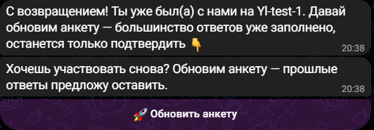

*Так выглядит `/start` у делегата прошлого события: вместо пустой анкеты — приветствие
возвращения с названием прошлого мероприятия и одна кнопка «🚀 Обновить анкету».*

Город мероприятия, трек участия и согласия делегат подтверждает заново всегда — город и
формат участия могли поменяться, а согласия по закону должны быть свежими. Резюме можно
оставить прошлое или прислать новое.

### Что видит менеджер

В карточке заявки в очереди модерации у повторной заявки появляется строка
**«🔁 Повторный: был(а) в …»** — сразу видно, что это не новый человек. На экране
статистики есть отдельная строка **«🔁 Повторных: N»**. Повторная заявка приходит в ту
же очередь модерации и одобряется точно так же, как обычная.

### Вторая строка в Google-таблице — это не баг

Лист заполняется дописыванием: каждая завершённая регистрация добавляет новую строку.
Значит, у вернувшегося делегата в таблице будут **ДВЕ строки** — прошлая и новая. В
базе бота он один человек, одна запись, поэтому кнопка «♻️ Пересобрать таблицу»
схлопнет дубли в одну строку — но она же сотрёт всё, что вы правили в листе руками.
Обычная рекомендация: жить с двумя строками до конца события, а не пересобирать
таблицу ради косметики.

### Оплата

При переходе в новое событие оплата делегата сбрасывается на «не оплачено» — новое
событие, новый взнос. Если делегат просто переподаёт заявку внутри того же события
(например, после отказа), оплата сохраняется как была.

### Импорт базы прошлого события

Кнопка **«📥 Импорт прошлого события»** на том же экране позволяет загрузить базу бота
с прошлого мероприятия и одним действием добавить всех делегатов оттуда как «прошлых» —
подробности в её собственном экране. Импортируются только сами делегаты, без коинов,
оплат и рефералов.

---

## 26. Mini App: приложение для менеджера и делегата

Отдельное веб-приложение, которое открывается прямо внутри Telegram (без установки
чего-либо): задания, монеты, рейтинг и (для менеджера) проверка сдач — на одном экране,
без диалога с ботом. Бот при этом никуда не девается — приложение читает и пишет ту же
базу, все тексты и переключатели берутся из тех же настроек.

### Точки входа

- **Кнопка «📱 Приложение»** в главном меню бота — обычная кнопка-текст. Нажатие присылает
  сообщение с кнопкой «📱 Открыть приложение» (текст сообщения и подпись кнопки — свои
  ключи в настройках).
- **Синяя кнопка меню чата** (рядом со скрепкой в Telegram) — то же приложение, включается
  и выключается автоматически вместе с приложением, без отдельной настройки.
- Обе точки входа появляются только когда приложение **включено** и разработчик задал ему
  адрес при деплое; без адреса кнопки скрыты сами, без ошибок у делегата.
- Менеджеру, у которого нет под рукой Telegram-клиента (например, открыл адрес приложения
  в обычном браузере на компьютере), приложение показывает отдельную кнопку входа через
  Telegram (Login Widget) — тот же вход, что у веб-дашборда (§26).

### Включение, выключение, разделы

`/admin` → **🔧 Управление** → **🎨 Оформление**:

- **«Mini App включён»** — главный рубильник. Выключение убирает приложение сразу у всех,
  включая менеджеров; второе нажатие в эту сторону просит подтверждение с объяснением
  последствий.
- **«Только менеджерам»** — скрыть приложение от делегатов, у менеджеров доступ остаётся;
  включение тоже требует подтверждения, обратное выключение — без него.
- Десять чекбоксов-разделов — какие экраны видны в приложении: 🎯 Задания, 🪙 Монеты,
  🏆 Рейтинг, 👤 Профиль, **📝 Анкета**, 🎮 Проверка сдач, 🗂 Задания (менеджер),
  **🗂 Отбор заявок**, 📊 Статистика, ⚙️ Настройки. Выключенный раздел просто не появляется
  в навигации приложения — у всех, кому он был бы виден. Выключение «📝 Анкета» прячет разом
  четыре вещи: плитку «📝 Анкета» в хабе, кнопку «📱 Заполнить в приложении» после приветствия
  бота, кнопку «✏️ Изменить анкету» в профиле приложения и кнопку приложения в
  сообщении-догонялке брошенных анкет — сама регистрация в чате при этом продолжает
  работать как обычно. Выключение «🗂 Отбор заявок» прячет плитку и экран отбора заявок
  в приложении — заявки менеджер по-прежнему принимает и отклоняет в чате бота (§7).

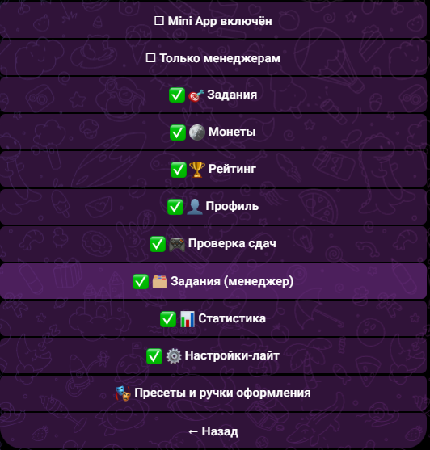

*Экран «🎨 Оформление»: сверху два рубильника приложения (на снимке оба выключены — пустой
квадратик), ниже восемь чекбоксов разделов, последней кнопкой — цвета и шрифты.*

### ⚙️ Настройки в приложении

Внутри приложения, для менеджера с правом «Настройки», есть отдельный экран «⚙️ Настройки» —
не урезанная копия чата и не только два тумблера Mini App, а **весь правимый реестр бота**,
теми же разделами, что в `/admin`: любой текст, тумблер, список, число, дата, фото и файл
правятся прямо на экране, без похода в бота (правка ролей и городов — исключение, у них свой
экран). Четыре вещи, которых в чате бота нет:

- **Поиск своими словами** — строка поиска ищет не только точное название настройки: слово
  «реквизиты» находит тексты про оплату, «дедлайн» — сроки, «таблица» — вкладки Google-таблицы,
  находит и с опечаткой.
- **Правка прямо в строке** — поле редактируется на месте, без отдельного экрана на каждый
  вопрос, как это устроено в чате.
- **Кнопка «👁 Показать как увидит делегат»** — под длинными текстами открывает превью с
  подставленными именем, датой, суммой и другими значениями вместо `{плейсхолдеров}` — виден
  готовый текст ДО сохранения.
- **Общее сохранение с показом «было → станет»** — можно поправить сколько угодно полей подряд,
  кнопка «Сохранить N изменений» открывает список: по каждому полю — что было и что станет,
  и только после подтверждения правки уходят в базу все разом.

Три вещи, которые стоит держать в голове:

1. **Тумблеры применяются сразу** — тап переключателя (кроме опасных, см. пункт 2) не ждёт
   общего сохранения и действует мгновенно, как в чате.
2. **Опасные изменения спрашивают подтверждение и называют, что именно пропадёт** — те же
   переключатели и настройки, что требуют второго тапа в чате (режим регистрации, режимы
   одобрения заявок, тип события, переименование вкладки Google-таблицы, «Mini App включён» →
   выключить, «Только менеджерам» → включить), в приложении тоже показывают предупреждение с
   последствиями — молчаливой опасной правки нет ни там, ни там.
3. **Если то же поле в это время правили в боте — приложение это увидит** — при сохранении
   экран покажет бейдж «Изменено в боте» с актуальным значением и предложит «Перезаписать»
   своей правкой или «Оставить как в боте» — молчаливой перезаписи чужой правки нет.

Бот остаётся полностью равноценным путём, а не «старой» версией приложения: обе поверхности
пишут в одну и ту же настройку и сразу видят правки друг друга, без перезапуска бота.

### 🎭 Пресеты и ручки оформления

Кнопка на экране «🎨 Оформление» открывает второй экран — внешний вид приложения:

- **Два пресета** — различаются НЕ цветом (акцент, вторичный цвет и фон у обоих одни и те же,
  брендовые): **«АЙСЕК — классика»** — прямые заголовки, плита без паттерна; **«ЮЛид»** —
  курсивные заголовки-герои, фирменный паттерн на плите, тон текстов на «ты». Выбор кнопкой
  показывает картинку-предпросмотр (если она загружена) и просит подтверждение — применение
  разом переставляет шрифт, паттерн и тон; свою правку цвета, загруженные лого, обложку и
  стикеры не трогает.
- Как только меняешь любую ручку вручную, экран сам показывает «Пресет: Своя (на базе …)» —
  вернуться к пресету одной кнопкой «↩️ Сбросить к пресету» (тоже с подтверждением и списком,
  что именно вернётся).
- **Ручки**: три цвета (акцент, вторичный, фон) — вводятся HEX-кодом текстом, бот тут же
  говорит словами, читается ли текст на этом фоне; шрифт заголовков (Raleway строгий /
  Raleway курсив — игривый / Lato нейтральный) — ручка теперь реально видна: курсив включается
  на крупных заголовках и числах плит на каждом делегатском экране, раньше она ни на что не
  влияла; тумблер «Игривый тон текстов»; тумблер «Бренд-паттерн на фоне».
- **Картинки** — присылаются фото прямо в бот, без файлов и ссылок: лого (и отдельно для
  тёмной темы), обложка (и для тёмной темы), **«Паттерн плиты»** — фон синей плиты на экранах
  приложения, без своей картинки берётся паттерн выбранного набора оформления, четыре стикера
  (пусто / успех / ошибка / топ-1 в рейтинге), своя иконка монеты. У каждой картинки — своя
  кнопка «🗑 Убрать» (для паттерна она возвращает паттерн набора, а не пустой фон).

### 📝 Анкета в приложении

Та же анкета, что и в чате бота, — общая на обе поверхности: ответы и текущий шаг живут в
одном месте, поэтому начатое в чате продолжается в приложении с того же вопроса, и наоборот.
Открывается плиткой «📝 Анкета» в хабе делегата (пока раздел включён — см. выше).

- **Новая анкета** — мастер, один вопрос на экран, тот же прогресс «N из M», что и в чате;
  умные пропуски работают так же.
- **Возвращенец прошлого сезона** — поля, где есть прошлый ответ, подставлены заранее с
  подписью «из прошлой анкеты»; «Дальше» без правки подтверждает значение и переносит его в
  анкету. То же самое делегат видит в чате экраном «Прошлый ответ — Оставить/Изменить» —
  поверхности синхронны (§24).
- **Открыл чат и приложение одновременно** — когда делегат возвращается в приложение
  (свернул-развернул), оно перечитывает ответы: то, что он успел написать в чате, помечено
  «обновлено в чате» и не теряется; недопечатанное в приложении тоже остаётся на месте.
- **Правка уже поданной анкеты** — кнопка «✏️ Изменить анкету» в профиле приложения (то же,
  что вход через чат) открывает обзор ответов, правится точечно одно-два поля, кнопка
  «💾 Отправить изменения». Что при этом происходит со статусом заявки и что видит
  менеджер — §7.
- **Резюме** — то же ограничение, что у файла в чате (PDF/DOCX, до 20 МБ); загруженный из
  приложения файл в течение ~30 секунд приходит копией в чат делегата, ссылка на облако
  появляется в профиле и в таблице.
- **Незаконченная анкета** — `/start` в чате предлагает «▶️ Продолжить с шага N» или
  «🔄 Начать заново» (со счётчиком ответов, которые пропадут); в сообщении-догонялке
  брошенной анкеты — вторая кнопка «📱 Продолжить в приложении».

Все тексты этого раздела (кнопки мастера, подписи бейджей, заголовки экрана «Заявка
принята», подтверждения отмены правки и так далее) не зашиты в код — они лежат в группе
**«📝 Регистрация»** (`/admin` → 📝 Анкета → «📝 Регистрация»), рядом со списками вариантов
вопросов, и правятся так же, как любой другой текст.

### 📋 Заявки в приложении

Экран «🗂 Отбор заявок» — та же очередь заявок, что «📋 Заявки» в чате бота (§7), но карточкой
на весь экран, как в Tinder: свайп вправо — одобрить, влево — отклонить, под карточкой те же
действия большими кнопками (на компьютере с мышью работают только кнопки, свайпа мышью нет).
Видит менеджер с правом «📋 Модерация заявок» (§22), включается тем же чекбоксом
«🗂 Отбор заявок», что и остальные разделы приложения (см. «Включение, выключение, разделы»
выше). Бот при этом остаётся полностью равноценным путём: то же решение можно принять и в
чате — заявка одна и та же, состояние общее для обеих поверхностей.

- **Карточка** — фото делегата (или инициалы, если профиль закрыт), имя, город, бейджи
  (трек, «🔁 Повторный», «✏️ Изменена», согласия) и ответы анкеты. Какие именно вопросы
  показывать — тот же экран «🧾 Поля карточки заявки» (`/admin` → 📋 Заявки), что и у карточки
  в чате: один набор вопросов на обе поверхности, поправил в одном месте — увидел в обоих.
  Кнопка «Показать всё» разворачивает остальные заполненные ответы. Если делегат правил
  анкету — в развёрнутой истории видно, что именно поменялось, «было → стало», с пометкой
  где это произошло (в чате или в приложении).
- **Отказ** — кнопка «❌» (или свайп влево) открывает список готовых причин, поле для своей
  причины и кнопку «отклонить без причины». Готовые причины отказа — тот же список
  «✍️ Причины отказа» (`/admin` → 📋 Заявки), что использует чат-бот при отказе с шаблоном:
  правишь список один раз, он одинаковый на обеих поверхностях. Делегат получает то же
  сообщение об отказе, что и при отказе из чата.
- **Отменить** — после решения на экране 5 секунд висит подсказка «Отменить»: пока она видна,
  решение можно откатить без следа — делегату ничего не приходит, заявка возвращается в
  очередь первой. Это фиксированные 5 секунд, в настройках их поменять нельзя. Как только
  подсказка исчезла (или менеджер принял следующее решение) — отменить уже нельзя, делегату
  уходит приветствие или отказ, а таблица обновляется.
- **Фильтры** — чипы над карточкой сужают очередь по треку (полная форма / вечеринка /
  краткая форма) и отдельно — только изменённые/повторно поданные анкеты.
- **«Принять всех N»** — кнопка в шапке очереди, как «Одобрить все» в чате: подтверждение
  называет и число заявок, и город, за который менеджер отвечает (если включён модуль
  городов, §21) — необратимо и затрагивает только этот город, заявки других городов не
  трогает.

### Что видит делегат

Все экраны построены вокруг одного «сигнатурного» блока — синей плиты с главным числом или
вопросом экрана сверху; списки под ней лежат плоскими строками во всю ширину, без вложенных
карточек.

- **Первый экран** (один раз, при первом открытии) — крупное приветствие и слоган на плите с
  фирменным паттерном, ниже три шага «как это работает»; все четыре текста настраиваются.
  Шаги пишутся одной строкой через `;`, внутри шага заголовок и пояснение разделяются тире.
- **Хаб** — плита с балансом монет и (если делегат уже в рейтинге) своим местом, строка
  «Следующее» с карточкой ближайшего задания, разделы приложения плоскими строками, внизу —
  дата и место события (берутся из настроек «🗓 Дата» и «📍 Место» того же города; отдельная
  настройка даты в формате ДД.ММ.ГГГГ даёт обратный отсчёт до события — пусто, строки не
  будет).
- **🎯 Задания** — плита с общим числом активных заданий, ниже список плоскими строками; тап
  открывает карточку.
- **🎯 Карточка задания** — награда монетами и остаток срока сверху, «Что сделать» с описанием,
  блок «Нужно прислать» — что именно и в каком виде.
- **Сдача задания** — та же логика, что в боте: фото/файл/текст/ссылка в зависимости от
  типа подтверждения, можно приложить несколько частей.
- **📝 Анкета** — номер шага и сам вопрос крупно на плите, полоса прогресса под ним, ниже
  список вопросов анкеты с галками у отвеченных.
- **👤 Профиль** — монограмма и имя на плите, чипы «заявка одобрена» и «оплачено» (второй
  чип — только при включённом модуле оплаты), ниже двумя списками контакты и ответы анкеты.
- **🪙 Монеты** — плита с балансом, справа от него — чип со своим местом в рейтинге (если
  делегат уже в нём), ниже история начислений плоским списком.
- **🏆 Рейтинг** — плита со своим местом (её нет вовсе, если делегат ещё не попал в рейтинг —
  экран начинается сразу подиумом), подиум топ-3, ниже плоским списком места 4–10, своя строка
  закреплена внизу экрана, даже если делегат не в топе.

Элементы выключенного модуля (оплата, геймификация) в приложении не показываются вовсе — не
«пусто», а отсутствуют: делегат не видит пустых рамок и прочерков там, где менеджер модуль не
включал.

### Что видит менеджер

Нужно право «Модерация геймификации» (§22) и включённый раздел — иначе экрана в навигации
просто нет:

- **🎮 Проверка сдач** — та же очередь, что «🎮 Проверка заданий» в боте: принять / другая
  сумма / отклонить.
- **🗂 Задания (менеджер)** — список с переключателем «Активные | Архив», кнопка
  «➕ Новое задание» открывает тот же пошаговый мастер, что и в боте.
- **🪙 Монеты вручную** и **📊 Статистика** — те же экраны, что «🪙 Монеты вручную» и
  «📊 Статистика геймы» в боте.

Пустые экраны — не голая заглушка, а понятный текст («Заданий пока нет.», «Архив пуст.»,
«Ручных операций пока не было.», «Сдач на проверке нет.») — все они правятся в `/admin` →
🔧 Управление → «🎨 Оформление», как и остальные тексты приложения.

---

## 27. Веб-дашборд статистики

Отдельная веб-страница (не путать с Mini App, §25) с той же статистикой регистраций, что
и «📊 Статистика» в боте, но в виде графиков на весь экран — удобно держать открытой на
проекторе или расшарить ссылку коллеге, у которого есть право доступа.

### Кто может зайти

Носители права **📊 Статистика** (§22), включая суперадминов. Вход — кнопка «Войти через
Telegram» на странице входа; после первого входа сессия сохраняется, права перепроверяются
на каждое открытие страницы — если право сняли в боте, доступ пропадёт без повторного входа.
Если кто-то пробует зайти без права, суперадминам приходит уведомление о попытке входа.

### Что на странице

- Воронка регистрации, динамика по дням, разрезы (источники, ВУЗы, курсы, направления
  обучения), «где чаще всего бросают анкету», блок статистики геймификации.
- При включённом модуле городов — переключатель города вверху страницы (для менеджера,
  привязанного к своему городу, переключателя нет — сразу показан его город); без выбора
  конкретного города — блок сравнения городов рядом.
- Название дашборда в шапке берётся из «Название события» в настройках.

Каждый блок можно скрыть отдельно — `/admin` → 📊 Данные → **📊 Дашборд**:
чекбоксы 🪜 Воронка, 📈 Динамика по дням, 🏫 ВУЗы, 📢 Источники, 📖 Курсы, 🎯 Направления,
🚪 Где бросают, 🎮 Гейма. Выключенный блок просто не рисуется на странице — данные при этом
никуда не пропадают, их можно снова показать в любой момент.

Адрес дашборда и включение самого веб-сервера задаёт разработчик при деплое — кнопки
поменять адрес в боте нет. Отдельного экспорта с дашборда нет — для выгрузки пользуйтесь
«📄 Экспорт CSV» в `/admin`.

---

## Приложение: анкета Юлид ’26 тумблерами

Как собрать анкету из 17 вопросов кнопками бота:

| # | Вопрос | Что включить |
|---|--------|--------------|
| 1 | Согласие на обработку данных | Тумблер «📋 Согласия» (раздел 📝 Анкета) + список согласий + PDF |
| 2 | ФИО | Спрашивается всегда |
| 3 | Дата рождения (ДД.ММ.ГГГГ) | «🎂 Дата рождения» |
| 4 | Телефон (+7…) | «📱 Телефон» |
| 5 | Telegram | Не нужен — бот берёт юзернейм сам |
| 6 | Ник в ВК | «🔵 ВК» |
| 7 | Город | «🏙 Город» + список в «🏙 Города (варианты)» |
| 8 | Образование (колледж/бакалавриат/…) | «🎓 Образование» |
| 9 | Курс | «📖 Курс» |
| 10 | Название ВУЗа | «🏫 ВУЗ» (режим «свободный ввод» или «выбор из базы») |
| 11 | Направление обучения | «🎯 Направление обучения» + список вариантов |
| 12 | Цель участия (несколько) | «🎯 Цель участия» + список вариантов |
| 13 | Форматы на форуме (несколько) | «📋 Форматы форума» + список вариантов |
| 14 | Темы и спикеры (текст) | «💬 Ожидания» + переписать формулировку в «✏️ Тексты вопросов» |
| 15 | Откуда узнал(-а) | «📢 Источник» + список в «📢 Источники» |
| 16 | Резюме PDF | «📄 Резюме» |
| 17 | Хочешь стать амбассадором? | «🧡 Амбассадор» |

---

Баг-репорт формулируем так: **что делал → что ожидал → что произошло** (+ скриншот).
